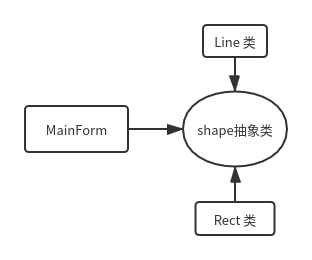
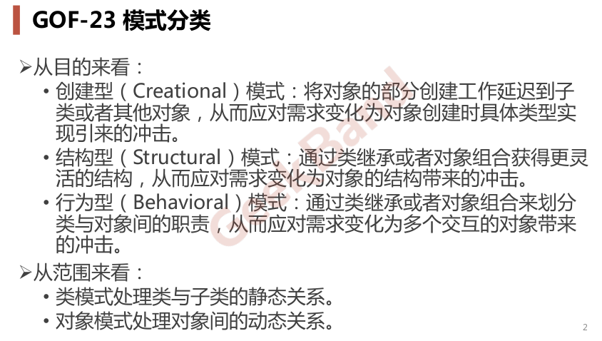
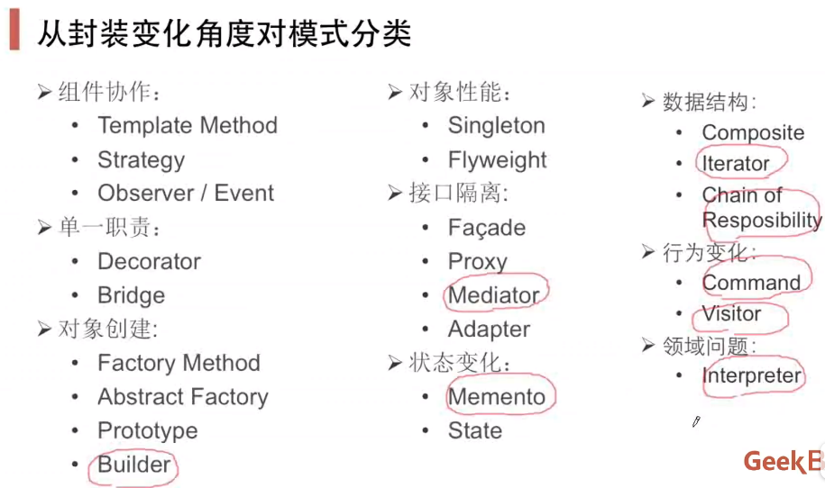
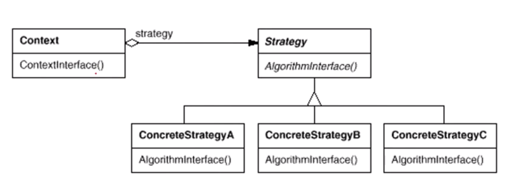
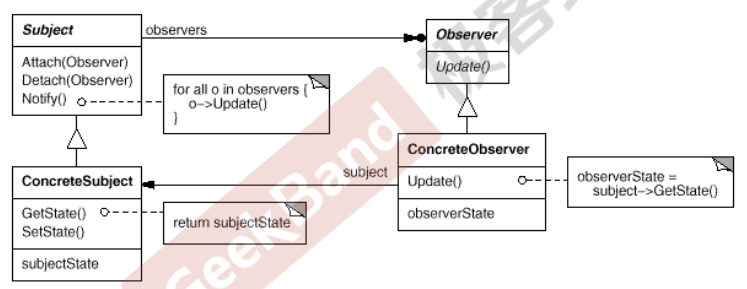
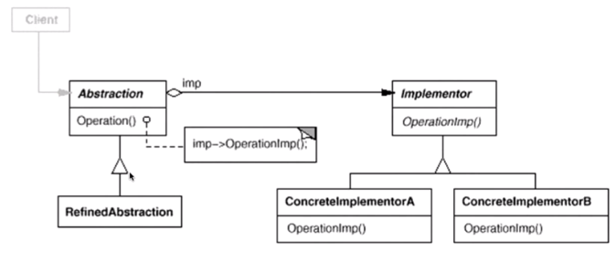
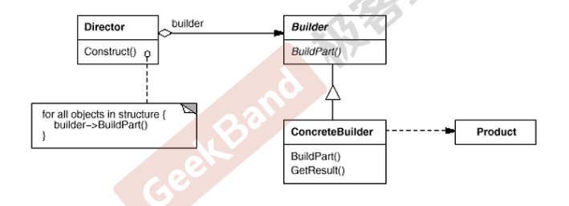
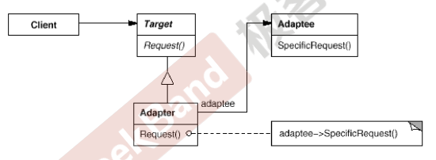
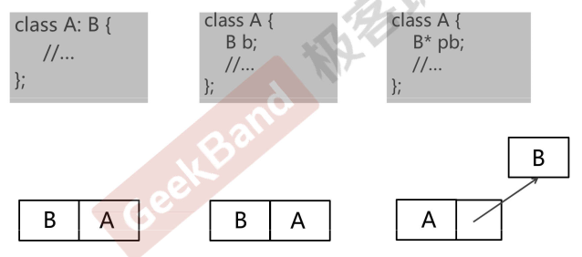

# 1. DesignPatterns
## 1.1. 面向对象设计原则
### 1.1.1. 依赖倒置原则(DIP)
    高层模块(稳定)不应该依赖于低层模块(变化),二者都应该依赖于抽象(稳定) 。   
    抽象(稳定)不应该依赖于实现细节(变化) ,实现细节应该依赖于抽象(稳定)。   


### 1.1.2. 开放封闭原则(OCP)
    对扩展开放,对更改封闭。
    类模块应该是可扩展的,但是不可修改。 
### 1.1.3. 单一职责原则(SRP)
    一个类应该仅有一个引起它变化的原因。
    变化的方向隐含着类的责任。
### 1.1.4. Liskov 替换原则(LSP)
    子类必须能够替换它们的基类(IS-A)。
    继承表达类型抽象。
### 1.1.5. 接口隔离原则(ISP)
    不应该强迫客户程序依赖它们不用的方法。
    接口应该小而完备。
### 1.1.6. 优先使用对象组合,而不是类继承
    类继承通常为“白箱复用”,对象组合通常为“黑箱复用”。
    继承在某种程度上破坏了封装性,子类父类耦合度高。
    而对象组合则只要求被组合的对象具有良好定义的接口,耦合度低。
### 1.1.7. 封装变化点
    使用封装来创建对象之间的分界层,让设计者可以在分界层的一侧进行修改,而不会对另一侧产生不良的影响,从而实现层次间的松耦合。
### 1.1.8. 针对接口编程,而不是针对实现编程
    不将变量类型声明为某个特定的具体类,而是声明为某个接口。
    客户程序无需获知对象的具体类型,只需要知道对象所具有的接口。
    减少系统中各部分的依赖关系,从而实现“高内聚、松耦合”的类型设计方案。
## 设计模式的一些分类



（其中红圈的模式现在并不常用了）

设计模式的应用不宜先入为主,一上来就使用设计模式是对设计模式的最大误用。没有一步到位的设计模式。敏捷软件开发实践提倡的“Refactoring to Patterns”是目前普遍公认的最好的使用设计模式的方法。
### 重构关键技法
静态 -> 动态
早绑定 -> 晚绑定
继承 -> 组合
编译时依赖 -> 运行时依赖
紧耦合 -> 松耦合
## Template Method 模板方法模式
在软件构建过程中,对于某一项任务,它常常有稳定的整体操作结构,但各个子步骤却有很多改变的需求
```C++
class Library{
public:
    void Run(){
        
        Step1();

        if (Step2()) { 
            Step3(); 
        }

        for (int i = 0; i < 4; i++){
            Step4(); 
        }

        Step5();

    }
	virtual ~Library(){ }

protected:
	void Step1() { 
        //.....
    }
	void Step3() {
        //.....
    }
	void Step5() { 
		//.....
	}

	virtual bool Step2() = 0;
    virtual void Step4() =0; 
};
```
### 模式定义
定义一个操作中的算法的骨架 （稳定，如Run() 等过程），而将一些步骤延迟(变化)到子类中。Template Method 使得子类可以不改变(复用)一个算法的结构，即可重定义（override 重写，利用虚函数）该算法的某些特定步骤。（这个过程也是体现了晚绑定的思想）

在具体实现方面,被Template Method调用的虚方法可以具有实现，也可以没有任何实现(抽象方法、纯虚方法)，但一般推荐将它们设置为**protected**方法（因为这样的虚方法一般都是要被基类中稳定的骨架方法所调用的，而不暴露在类外）。
## Strategy 策略模式
在软件构建过程中,某些对象使用的算法可能多种多样,经常改变,如果将这些算法都编码到对象中,将会使对象变得异常复杂;而且有时候支持不使用的算法也是一个性能负担。
```C++
class TaxStrategy{
public:
    virtual double Calculate(const Context& context)=0;
    virtual ~TaxStrategy(){}
};


class CNTax : public TaxStrategy{
public:
    virtual double Calculate(const Context& context){
        //***********
    }
};

class USTax : public TaxStrategy{
public:
    virtual double Calculate(const Context& context){
        //***********
    }
};

class SalesOrder{
private:
    TaxStrategy* strategy;

public:
    SalesOrder(StrategyFactory* strategyFactory){
        this->strategy = strategyFactory->NewStrategy();
    }
    ~SalesOrder(){
        delete this->strategy;
    }

    public double CalculateTax(){
        //...
        Context context();

        double val = 
            strategy->Calculate(context); //多态调用
        //...
    }
};
```
### 模式定义
定义一系列算法,把它们一个个封装起来,并且使它们可互相替换(变化)。该模式使得算法可独立于使用它的客户程序(稳定)而变化(扩展,子类化)。


Strategy及其子类为组件提供了一系列可重用的算法,从而可以使得类型在运行时方便地根据需要在各个算法之间进行切换。
Strategy模式提供了用条件判断语句以外的另一种选择,消除条件判断语句,就是在解耦合。含有许多条件判断语句的代码通常都需要Strategy模式。
如果Strategy对象没有实例变量,那么各个上下文可以共享同一个Strategy对象（Singleton),从而节省对象开销。
## Observer 观察者模式
###  组件协作模式
可分类归属于 组件协作模式，组件协作”模式通过晚期绑定,来实现框架与应用程序之间的松耦合，典型的组件协作模式包括：Template Method，Strategy，Observer / Event
### 动机
在软件构建过程中,我们需要为某些对象建立一种“通知依赖关系” ——一个对象(目标对象)的状态发生改变,所有的依赖对象(观察者对象)都将得到通知。如果这样的依赖关系过于紧密,将使软件不能很好地抵御变化。
### 模式定义
定义对象间的一种一对多(变化)的依赖关系，以便当一个对象(Subject)的状态发生改变时，所有依赖于它的对象都得到通知并自动更新。


使用面向对象的抽象,Observer模式使得我们可以独立地改变目标与观察者，从而使二者之间的依赖关系达致松耦合。
目标发送通知时，无需指定观察者，通知(可以携带通知信息作为参数)会自动传播。
观察者自己决定是否需要订阅通知，目标对象对此一无所知。
Observer模式是基于事件的UI框架中非常常用的设计模式，也是MVC模式的一个重要组成部分。
```C++
// 重构前：将具体的某个观察者（progressBar）放到主界面中，但无法适应变化的观察者要求，也许会有不同的进度条需求
class FileSplitter
{
	string m_filePath;
	int m_fileNumber;
	ProgressBar* m_progressBar;

public:
	FileSplitter(const string& filePath, int fileNumber, ProgressBar* progressBar) :
		m_filePath(filePath), 
		m_fileNumber(fileNumber),
		m_progressBar(progressBar){
	}

	void split(){
		//1.读取大文件
		
		//2.分批次向小文件中写入
		for (int i = 0; i < m_fileNumber; i++){
			//...
			float progressValue = m_fileNumber;
			progressValue = (i + 1) / progressValue;
			m_progressBar->setValue(progressValue);
		}
	}
};


class MainForm : public Form
{
	TextBox* txtFilePath;
	TextBox* txtFileNumber;
	ProgressBar* progressBar;

public:
	void Button1_Click(){
		string filePath = txtFilePath->getText();
		int number = atoi(txtFileNumber->getText().c_str());

		FileSplitter splitter(filePath, number, progressBar);

		splitter.split();
	}
};

// 重构后：使用MainForm继承自IProgress（C++推荐的继承自接口），
class IProgress{
public:
	virtual void DoProgress(float value) = 0;
	virtual ~IProgress(){}
};


class FileSplitter
{
	string m_filePath;
	int m_fileNumber;
	vector<IProgress*>  m_iprogressList; // 抽象通知机制，支持多个观察者

public:
	FileSplitter(const string& filePath, int fileNumber) :
		m_filePath(filePath), 
		m_fileNumber(fileNumber){
	}

	void split(){
		//1.读取大文件

		//2.分批次向小文件中写入
		for (int i = 0; i < m_fileNumber; i++){
			//...

			float progressValue = m_fileNumber;
			progressValue = (i + 1) / progressValue;
			onProgress(progressValue);//发送通知
		}
	}


	void addIProgress(IProgress* iprogress){
		m_iprogressList.push_back(iprogress);
	}

	void removeIProgress(IProgress* iprogress){
		m_iprogressList.remove(iprogress);
	}


protected:
	virtual void onProgress(float value){
		vector<IProgress*>::iterator itor=m_iprogressList.begin();
		while (itor != m_iprogressList.end() )
			(*itor)->DoProgress(value); //更新进度条
			itor++;
		}
	}
};


class ConsoleNotifier : public IProgress {
public:
	virtual void DoProgress(float value){
		cout << ".";
	}
};


class MainForm : public Form, public IProgress
{
	TextBox* txtFilePath;
	TextBox* txtFileNumber;

	ProgressBar* progressBar;

public:
	void Button1_Click(){
		string filePath = txtFilePath->getText();
		int number = atoi(txtFileNumber->getText().c_str());

		ConsoleNotifier cn;

		FileSplitter splitter(filePath, number);

		splitter.addIProgress(this); // Windows风格的MainForm订阅通知
		splitter.addIProgress(&cn); // Console订阅通知

		splitter.split();

		splitter.removeIProgress(this);
	}

	virtual void DoProgress(float value){
		progressBar->setValue(value);
	}
};
```
## Decorator 装饰模式
### “单一职责”模式
在软件组件的设计中，如果责任划分的不清晰，使用继承得到的结果往往是随着需求的变化，子类急剧膨胀，同时充斥着重复代码，这时候的关键是划清责任。

不同于前面的设计模式，属于“单一职责”模式，其典型模式包括：Decorator，Bridge
### 动机
在某些情况下我们可能会“过度地使用继承来扩展对象的功能”，由于继承为类型引入的静态特质，使得这种扩展方式缺乏灵活性；并且随着子类的增多(扩展功能的增多)，各种子类的组合(扩展功能的组合)会导致更多子类的膨胀。

如何使“对象功能的扩展”能够根据需要来动态地实现？同时避免“扩展功能的增多”带来的子类膨胀问题？从而使得任何“功能扩展变化”所导致的影响将为最低?
### 模式定义
动态(组合)地给一个对象增加一些额外的职责。就增加功能而言，Decorator模式比生成子类(继承)更为灵活(消除重复代码 & 减少子类个数)，即组合优于继承。
### 要点
通过采用组合而非继承的手法，Decorator模式实现了在运行时动态扩展对象功能的能力，而且可以根据需要扩展多个功能。避免了使用继承带来的“灵活性差”和“多子类衍生问题”。

Decorator类在接口上表现为is-a Component的继承关系，即Decorator类继承了Component类所具有的接口。但在实现上又表现为has-a Component的组合关系，即Decorator类又使用了另外一个Component类。——既继承某一个类，又使用该类作为组合类。

Decorator模式的目的并非解决“多子类衍生的多继承”问题，Decorator模式应用的要点在于解决“主体类在多个方向上的扩展功能”——是为“装饰”的含义。
```C++
//***********************************************
// 原操作，以Stream为基类，扩展文件流，内存流等子类。
// 这时，还要加入缓存，加密等新特性，原操作做法是分别拓展出更多的子类，
// 但是这样的组合类数量会成指数增加，代码冗余度高。
// 总类的个数：1+n+(Cm~1+Cm~2+...) = n+2^n;
//***********************************************
//业务操作
class Stream{
public：
    virtual char Read(int number)=0;
    virtual void Seek(int position)=0;
    virtual void Write(char data)=0;

    virtual ~Stream(){}
};

//主体类
class FileStream: public Stream{
public:
    virtual char Read(int number){
        //读文件流
    }
    virtual void Seek(int position){
        //定位文件流
    }
    virtual void Write(char data){
        //写文件流
    }
};

class NetworkStream :public Stream{
public:
    virtual char Read(int number);
    virtual void Seek(int position);
    virtual void Write(char data);
};

class MemoryStream :public Stream{
public:
    virtual char Read(int number);
    virtual void Seek(int position);
    virtual void Write(char data);
};

//扩展操作
class CryptoFileStream :public FileStream{
public:
    virtual char Read(int number){
        //额外的加密操作...
        FileStream::Read(number);//读文件流
    }
    virtual void Seek(int position){
        //额外的加密操作...
        FileStream::Seek(position);//定位文件流
    }
    virtual void Write(byte data){
        //额外的加密操作...
        FileStream::Write(data);//写文件流
    }
};

class CryptoNetworkStream : :public NetworkStream{
public:
    virtual char Read(int number){
        //额外的加密操作...
        NetworkStream::Read(number);//读网络流
    }
    virtual void Seek(int position){
        //额外的加密操作...
        NetworkStream::Seek(position);//定位网络流
    }
    virtual void Write(byte data){
        //额外的加密操作...
        NetworkStream::Write(data);//写网络流
    }
};

class CryptoMemoryStream : public MemoryStream{
    //...
};

class BufferedFileStream : public FileStream{
    //...
};

class BufferedNetworkStream : public NetworkStream{
    //...
};

class BufferedMemoryStream : public MemoryStream{
    //...
}

// 组合多种特征的类
class CryptoBufferedFileStream :public FileStream{
    //...
};


void Process(){
    //编译时装配
    CryptoFileStream *fs1 = new CryptoFileStream();

    BufferedFileStream *fs2 = new BufferedFileStream();

    CryptoBufferedFileStream *fs3 =new CryptoBufferedFileStream();
}

//***********************************************
// Decorator设计模式，主体类和扩展的文件流等不变。
// 对于缓存等新特性，只设计对应特性的类而不指定对应具体哪个类，
// 由于该类需要有Stream基类的那些接口，所以需要继承自Stream，
// 同时由于想要运行时绑定具体流类型，所以还得传入一个具体流成员变量，所以还得有一个基类Stream成员变量
// 在这里，中间实现了一个Decorator类以方便后面继承。
// 总类的个数：1+n+1+m;
//***********************************************


//业务操作
class Stream{
public：
    virtual char Read(int number)=0;
    virtual void Seek(int position)=0;
    virtual void Write(char data)=0;

    virtual ~Stream(){}
};

//主体类
class FileStream: public Stream{
public:
    virtual char Read(int number){
        //读文件流
    }
    virtual void Seek(int position){
        //定位文件流
    }
    virtual void Write(char data){
        //写文件流
    }
};

class NetworkStream :public Stream{
public:
    virtual char Read(int number);
    virtual void Seek(int position);
    virtual void Write(char data);
};

class MemoryStream :public Stream{
public:
    virtual char Read(int number);
    virtual void Seek(int position);
    virtual void Write(char data);
};

//扩展操作，中间增加 DecoratorStream 类
DecoratorStream: public Stream{
protected:
    Stream* stream;//...

    DecoratorStream(Stream * stm):stream(stm) {}
};

class CryptoStream: public DecoratorStream {
public:
    CryptoStream(Stream* stm):DecoratorStream(stm) {}

    virtual char Read(int number){
        //额外的加密操作...
        stream->Read(number);//读文件流
    }
    virtual void Seek(int position){
        //额外的加密操作...
        stream->Seek(position);//定位文件流
    }
    virtual void Write(byte data){
        //额外的加密操作...
        stream->Write(data);//写文件流
    }
};


class BufferedStream : public DecoratorStream{
public:
    BufferedStream(Stream* stm):DecoratorStream(stm) {}
    //...
};


void Process(){
    //运行时装配
    FileStream* s1=new FileStream();
    CryptoStream* s2=new CryptoStream(s1);
    BufferedStream* s3=new BufferedStream(s1);

    BufferedStream* s4=new BufferedStream(s2);
}
```
组织格式演化：
 ==> 
## Bridge 桥模式
### 动机
由于某些类型的固有的实现逻辑,使得它们具有两个，乃至多个变化的维度。
### 模式定义
将抽象部分(业务功能)与实现部分(平台实现)分离，使它们都可以独立地变化。
```C++
//******************************************************
//重构前由Message基类衍生出n个平台实现类，
//又由每个平台实现类都需要m个业务抽象
//这里业务抽象就产生大量冗余代码
// 类总个数 1+n+m*n
//******************************************************
class Messager{
public:
    virtual void Login(string username, string password)=0;
    virtual void SendMessage(string message)=0;
    virtual void SendPicture(Image image)=0;

    virtual void PlaySound()=0;
    virtual void DrawShape()=0;
    virtual void WriteText()=0;
    virtual void Connect()=0;

    virtual ~Messager(){}
};


//平台实现 n
class PCMessagerBase : public Messager{
public:
    virtual void PlaySound(){
        //**********
    }
    virtual void DrawShape(){
        //**********
    }
    virtual void WriteText(){
        //**********
    }
    virtual void Connect(){
        //**********
    }
};

class MobileMessagerBase : public Messager{
public:
    virtual void PlaySound(){
        //==========
    }
    virtual void DrawShape(){
        //==========
    }
    virtual void WriteText(){
        //==========
    }
    virtual void Connect(){
        //==========
    }
};


//业务抽象 m*n
class PCMessagerLite : public PCMessagerBase {
public:
    virtual void Login(string username, string password){
        PCMessagerBase::Connect();
        //........
    }
    virtual void SendMessage(string message){
        PCMessagerBase::WriteText();
        //........
    }
    virtual void SendPicture(Image image){
        PCMessagerBase::DrawShape();
        //........
    }
};


class PCMessagerPerfect : public PCMessagerBase {
public:
    virtual void Login(string username, string password){
        PCMessagerBase::PlaySound();
        //********
        PCMessagerBase::Connect();
        //........
    }
    virtual void SendMessage(string message){
        PCMessagerBase::PlaySound();
        //********
        PCMessagerBase::WriteText();
        //........
    }
    virtual void SendPicture(Image image){
        PCMessagerBase::PlaySound();
        //********
        PCMessagerBase::DrawShape();
        //........
    }
};


class MobileMessagerLite : public MobileMessagerBase {
public:
    virtual void Login(string username, string password){
        MobileMessagerBase::Connect();
        //........
    }
    virtual void SendMessage(string message){
        MobileMessagerBase::WriteText();
        //........
    }
    virtual void SendPicture(Image image){
        MobileMessagerBase::DrawShape();
        //........
    }
};


class MobileMessagerPerfect : public MobileMessagerBase {
public:
    virtual void Login(string username, string password){
        MobileMessagerBase::PlaySound();
        //********
        MobileMessagerBase::Connect();
        //........
    }
    virtual void SendMessage(string message){
        MobileMessagerBase::PlaySound();
        //********
        MobileMessagerBase::WriteText();
        //........
    }
    virtual void SendPicture(Image image){
        MobileMessagerBase::PlaySound();
        //********
        MobileMessagerBase::DrawShape();
        //........
    }
};


void Process(){
        //编译时装配
        Messager *m = new MobileMessagerPerfect();
}


//***************************************************
//将类中实际用的按维度分成两个类，利用实现类(Imp)作为Message类的成员
//重构前，平台实现类没有重写login等函数，因此还是抽象类，是不能实例化的
//于是重构将实现类和业务两维度分开更合适。
//重构后，业务抽象后的MessagerLite等类继承自Message基类，
//同时需要MessagerImp类的组件作为类的成员:
//这里由于MessagerLite等类都需要这个类，所以将该成员上提到了基类中。
//类的数目：2+n+m
//***************************************************
class MessagerImp{
public:
    virtual void PlaySound()=0;
    virtual void DrawShape()=0;
    virtual void WriteText()=0;
    virtual void Connect()=0;

    virtual ~MessagerImp(){}
};


class Messager{
protected:
     MessagerImp* messagerImp;//...
public:
    Messager(MessagerImp* mImp) : messagerImp(mImp) {}
    virtual void Login(string username, string password)=0;
    virtual void SendMessage(string message)=0;
    virtual void SendPicture(Image image)=0;

    virtual ~Messager(){}
};


//平台实现 n
class PCMessagerImp : public MessagerImp{
public:
    virtual void PlaySound(){
        //**********
    }
    virtual void DrawShape(){
        //**********
    }
    virtual void WriteText(){
        //**********
    }
    virtual void Connect(){
        //**********
    }
};

class MobileMessagerImp : public MessagerImp{
public:
    virtual void PlaySound(){
        //==========
    }
    virtual void DrawShape(){
        //==========
    }
    virtual void WriteText(){
        //==========
    }
    virtual void Connect(){
        //==========
    }
};


//业务抽象 m
class MessagerLite :public Messager {
public:
    MessagerLite(MessagerImp* mImp) : Messager(mImp){} // 利用父类构造函数初始化子类
    MessagerLite(MessagerImp* mImp) {
        Message::Message(Imp);
    }
    virtual void Login(string username, string password){
        messagerImp->Connect();
        //........
    }
    virtual void SendMessage(string message){
        messagerImp->WriteText();
        //........
    }
    virtual void SendPicture(Image image){
        messagerImp->DrawShape();
        //........
    }
};


class MessagerPerfect :public Messager {
public:
    MessagerPerfect(MessagerImp* mImp) : Messager(mImp){}
    virtual void Login(string username, string password){
        messagerImp->PlaySound();
        //********
        messagerImp->Connect();
        //........
    }
    virtual void SendMessage(string message) {
        messagerImp->PlaySound();
        //********
        messagerImp->WriteText();
        //........
    }
    virtual void SendPicture(Image image) {
        messagerImp->PlaySound();
        //********
        messagerImp->DrawShape();
        //........
    }
};


void Process(){
    //运行时装配
    MessagerImp* mImp = new PCMessagerImp();
    Messager *m = new MessagerLite(mImp);
    MessagerLite *pc_message_lite = new MessagerLite(mImp);
}
```
### 结构
桥接模式主要使用抽象关联取代传统的多重继承，将类之间的静态继承关系转换为动态地对象组合关系，使得系统更加灵活，并易于扩展，同时有效地控制了系统中类的个数。

## Factory Method 工厂方法
### “对象创建”模式
通过“对象创建” 模式绕开new，来避免对象创建(new)过程中所导致的紧耦合(依赖具体类)，从而支持对象创建的稳定。它是接口抽象之后的第一步工作。

典型模式包括：**Factory Method，Abstract Factory，Prototype，Builder**
### 动机
在软件系统中，经常面临着创建对象的工作；由于需求的变化，需要创建的对象的具体类型经常变化。
### 模式定义
定义一个用于创建对象的接口，让子类决定实例化哪一个类。Factory Method使得一个类的实例化延迟(目的：解耦，手段：虚函数)到子类。
```C++
// MainForm的创建依赖于具体的splitter类（new过程中所导致的紧耦合）
class ISplitter{
public:
    virtual void split()=0;
    virtual ~ISplitter(){}
};

class BinarySplitter : public ISplitter{
    
};

class TxtSplitter: public ISplitter{
    
};

class PictureSplitter: public ISplitter{
    
};


class MainForm : public Form
{
	TextBox* txtFilePath;
	TextBox* txtFileNumber;
	ProgressBar* progressBar;

public:
	void Button1_Click(){
		ISplitter * splitter = new BinarySplitter();//依赖具体类
        splitter->split();

	}
};
//*************************************************************
//使用工厂类来产生各种不同的产品实现晚绑定
//这里有一个问题：为什么不直接传入具体splitter指针？
//答：ISplitter放MainForm里面, 就需要考虑splitter是否有状态, 以及是否线程安全
//用工厂方法, 每次都是新的splitter, 就不会有上述问题。
//即每次都是创建的新的对象而不是传入的一个对象。
//*************************************************************
//抽象类
class ISplitter{
public:
    virtual void split()=0;
    virtual ~ISplitter(){}
};


//工厂基类
class SplitterFactory{
public:
    virtual ISplitter* CreateSplitter()=0;
    virtual ~SplitterFactory(){}
};

//具体类
class BinarySplitter : public ISplitter{
    
};

class TxtSplitter: public ISplitter{
    
};

class PictureSplitter: public ISplitter{
    
};

//具体工厂
class BinarySplitterFactory: public SplitterFactory{
public:
    virtual ISplitter* CreateSplitter(){
        return new BinarySplitter();
    }
};

class TxtSplitterFactory: public SplitterFactory{
public:
    virtual ISplitter* CreateSplitter(){
        return new TxtSplitter();
    }
};

class PictureSplitterFactory: public SplitterFactory{
public:
    virtual ISplitter* CreateSplitter(){
        return new PictureSplitter();
    }
};


class MainForm : public Form
{
    SplitterFactory*  factory;//工厂
public:
    MainForm(SplitterFactory*  factory){
        this->factory=factory;
    }

	void Button1_Click(){
		ISplitter * splitter = factory->CreateSplitter(); //多态new
        splitter->split();
	}
};
```

Factory Method模式通过面向对象的手法，将所要创建的具体对象工作延迟到子类，从而实现一种扩展(而非更改)的策略

Factory Method模式解决“单个对象”的需求变化。缺点在于要求创建方法/参数相同。
## 抽象工厂
### 动机
在软件系统中，经常面临着“一系列相互依赖的对象”的创建工作。同时，由于需求的变化，往往存在更多系列对象的创建工作。
### 模式定义
提供一个接口，让该接口负责创建一系列“相关或者相互依赖的对象”，无需指定它们具体的类。
```C++
//**************************************************************
//原实现，但其中数据库实现可能不只是SqlConnection,SqlCommand
//可能设计别的数据库如mysql，Oracle种类，此处需要拓展，并进行抽象
//**************************************************************
//数据库访问有关的基类
class IDBConnection{};
class IDBCommand{};

//支持SQL Server
class SqlConnection: public IDBConnection{};
class SqlCommand: public IDBCommand{};


class EmployeeDAO{
public:
    vector<EmployeeDO> GetEmployees(){
        IDBConnection* connection =
            new SqlConnection();
        connection->ConnectionString("...");

        IDBCommand* command =
            new SqlCommand();
        command->CommandText="...";
        command->SetConnection(connection);    //相关性
    }
};
//**************************************************************
//如果还和之前工厂方法那样创建，就需要创建对应类数量个对应的工厂类，数量繁杂;
//并且这里代码中不同的工厂产品之间是有关联性的,
//传入的几个工厂类必须同属于同一数据库种类!
//正是因为这种关联性，可以将这些工厂类放到一起
//**************************************************************
//数据库访问有关的基类
class IDBConnection{};
class IDBCommand{};


class IDBFactory{
public:
    virtual IDBConnection* CreateDBConnection()=0;
    virtual IDBCommand* CreateDBCommand()=0;
};


//支持SQL Server
class SqlConnection: public IDBConnection{};
class SqlCommand: public IDBCommand{};

class SqlDBFactory:public IDBFactory{
public:
    virtual IDBConnection* CreateDBConnection() {}
    virtual IDBCommand* CreateDBCommand() {}
};

//支持Oracle
class OracleConnection: public IDBConnection{};
class OracleCommand: public IDBCommand{};

class OracleDBFactory:public IDBFactory{
public:
    virtual IDBConnection* CreateDBConnection() {}
    virtual IDBCommand* CreateDBCommand() {}
};


class EmployeeDAO{
    IDBFactory* dbFactory;
public:
    vector<EmployeeDO> GetEmployees(){
        IDBConnection* connection =
            dbFactory->CreateDBConnection();
        connection->ConnectionString("...");

        IDBCommand* command =
            dbFactory->CreateDBCommand();
        command->CommandText("...");
        command->SetConnection(connection); //关联性
    }
};
```
### 结构

## Prototype 原型模式
### 动机
在软件系统中，经常面临着“某些复杂结构对象”的创建工作。由于需求的变化，这些对象经常面临着剧烈的变化，但它们却拥有比较稳定一致的接口。

因为工厂方法传入的对象，在new的过程中可能存在较多的状态，对其进行创建时可能比较复杂，这时克隆的性价比更高。
### 模式定义
使用原型实例指定创建对象的种类，然后通过（深）拷贝这些原型来创建新的对象。
### 结构

```C++
//基于抽象方法中重构前例子：
//抽象类
class ISplitter{
public:
    virtual void split()=0;
    virtual ISplitter* clone()=0; //通过克隆自己来创建对象
    virtual ~ISplitter(){}
};

//具体类
class BinarySplitter : public ISplitter{
public:
    virtual ISplitter* clone(){
        return new BinarySplitter(*this); //调用拷贝构造函数克隆
    }
};

class TxtSplitter: public ISplitter{
public:
    virtual ISplitter* clone(){
        return new TxtSplitter(*this);
    }
};

class PictureSplitter: public ISplitter{
public:
    virtual ISplitter* clone(){
        return new PictureSplitter(*this);
    }
};


class MainForm : public Form
{
    ISplitter*  prototype;//原型对象
public:
    MainForm(ISplitter*  prototype){
        this->prototype=prototype;
    }

	void Button1_Click(){
	    //原型对象仅供克隆，不直接使用，使用克隆产生的新对象
		ISplitter * splitter = prototype->clone(); //克隆原型
        splitter->split();
	}
};

```
原型模式同样用于隔离类对象的使用者和具体类型（易变类）之间的耦合关系，同样要求这些“易变类”拥有稳定的接口。

在解决“new”问题——“如何创建易变类的实体对象”上采用原型克隆的方式，使得创建更加方便。在别的语言没有拷贝构造函数的框架中，可采用序列化的方式实现深拷贝。
## Builder 构建器
### 动机
在软件系统中，有时候面临着“一个复杂对象”的创建工作，其通常由各个部分的子对象用一定的算法构成；由于需求的变化，这个复杂对象的各个部分经常面临着剧烈的变化，但是将它们组合在一起的算法却相对稳定。
```C++
//*******************************************************
//这里最开始实现和template模板的方式类似
//*******************************************************
class House{
public:
    // C++构造函数不能调用虚函数所以另外定义了Init()函数
    void Init(){
        BuildPart1();
        for (int i = 0; i < 4; i++) {
            BuildPart2();
        }
        if (BuildPart3) {
            BuildPart4();
        }
        BuildPart5();
    }
};
//********************************************************

class House{
    //....
};

class HouseBuilder {
public:
    House* GetResult(){
        return pHouse;
    }
    virtual ~HouseBuilder(){}
protected:
    House* pHouse;
	virtual void BuildPart1()=0;
    virtual void BuildPart2()=0;
    virtual void BuildPart3()=0;
    virtual void BuildPart4()=0;
    virtual void BuildPart5()=0;
};

class StoneHouse: public House{

};

class StoneHouseBuilder: public HouseBuilder{
protected:
    virtual void BuildPart1(){
        //pHouse->Part1 = ...;
    }
    virtual void BuildPart2(){};
    virtual void BuildPart3(){};
    virtual void BuildPart4(){};
    virtual void BuildPart5(){};
};


class HouseDirector{
public:
    HouseBuilder* pHouseBuilder;

    HouseDirector(HouseBuilder* pHouseBuilder){
        this->pHouseBuilder=pHouseBuilder;
    }

    House* Construct(){
        pHouseBuilder->BuildPart1();
        for (int i = 0; i < 4; i++){
            pHouseBuilder->BuildPart2();
        }
        bool flag=pHouseBuilder->BuildPart3();
        if(flag){
            pHouseBuilder->BuildPart4();
        }
        pHouseBuilder->BuildPart5();
        return pHouseBuilder->GetResult();
    }
};
```
### 模式定义
将一个复杂对象的构建与其表示相分离，使得同样的构建过程(稳定)可以创建不同的表示(变化)。


Builer模式中主要有两个角色，一个是builder（相当于底层的建筑工人），一个是director（相当于设计师）。builder负责提供构建对象各个部分的功能以及最后组装对象的功能，而director负责调用builder的功能来创建对象。
## Singleton 单例模式
### “对象性能”模式
面向对象很好地解决了“抽象”的问题，但是不可避免地要付出一定的代价。对于通常情况来说，面向对象的成本大都可以忽略不计。但是某些情况，面向对象所带来的成本必须谨慎处理。

典型模式包括：**Singleton，Flyweight**
### 动机
在软件系统中，经常有这样一些特殊的类，必须保证它们在系统中只存在一个实例，才能保证其逻辑正确性以及良好的效率。
### 模式定义
保证一个类仅有一个实例，并提供一个该实例的全局访问点。

多个 Singleton 实例相互引用的情况下, 需要谨慎处理析构函数。

Singleton模式中的实例构造器可以设置为 protected 以运行子类派生。一般不要支持拷贝构造函数和Clone接口。Singleton本身比较简单，但是在多线程环境下安全的Singleton比较重要，对双检查锁的检查也比较重要。
### 有关多线程安全与双检查锁失效
```C++
//饿汉模式 单例实例在程序运行时被立即执行初始化
class Singleton{
private:
    Singleton();
    Singleton(const Singleton& other);
public:
    static Singleton* getInstance();
    static Singleton* m_instance;
};

Singleton* Singleton::m_instance=nullptr;

//线程非安全版本
Singleton* Singleton::getInstance() {
    if (m_instance == nullptr) {
        m_instance = new Singleton();
    }
    return m_instance;
}

//线程安全版本，但锁的代价过高
//因为如果多个线程都是读操作，会导致不必要的等待，在多并发情况下不适合
Singleton* Singleton::getInstance() {
    Lock lock;
    if (m_instance == nullptr) {
        m_instance = new Singleton();
    }
    return m_instance;
}

//双检查锁(double check lock)，但由于内存读写reorder不安全
//内存读写reorder是指在底层执行时为了优化效率CPU指令序列会reorder，如：
//new分为三步：1.malloc 2.执行构造器 3.返回指针;
//但底层执行的顺序可能reorder成1->3->2，先返回指针，在创建对象。
//如下，则可能出现A线程刚malloc,返回了指针，
//B线程进入函数，判断指针非空，返回了该指针，但此时该指针指向对象还未创建。
//这时如果有用户使用该指针则会出现问题！
Singleton* Singleton::getInstance() {
    if(m_instance==nullptr){
        Lock lock;
        //加完锁还要再检查判断一次
        //避免另一个线程通过上层判断，前一个线程解锁后又new一次
        if (m_instance == nullptr) {
            m_instance = new Singleton();
        }
    }
    return m_instance;
}

//C++ 11版本之后的跨平台实现 (volatile)
std::atomic<Singleton*> Singleton::m_instance;
std::mutex Singleton::m_mutex;

Singleton* Singleton::getInstance() {
    Singleton* tmp = m_instance.load(std::memory_order_relaxed);
    std::atomic_thread_fence(std::memory_order_acquire);//获取内存fence
    if (tmp == nullptr) {
        std::lock_guard<std::mutex> lock(m_mutex);
        tmp = m_instance.load(std::memory_order_relaxed);
        if (tmp == nullptr) {
            tmp = new Singleton;
            std::atomic_thread_fence(std::memory_order_release);//释放内存fence
            m_instance.store(tmp, std::memory_order_relaxed);
        }
    }
    return tmp;
}

// 利用局部静态变量，可以保证只有单例，而且不会出现静态成员变量初始化的问题。
class Log {
public:
  static Log* Instance() {
    static Log theLog;
    return &theLog;
  }

  virtual void Write(char const *logline);
  virtual bool SaveTo(char const *filename);

private:
  Log();          // ctor is hidden
  Log(Log const&);      // copy ctor is hidden
  Log& operator=(Log const&);  // assign op is hidden

  static vector<string> m_data;
};
```
## FlyWeight 享元模式
### 动机
在软件系统采用纯粹对象方案的问题在于大量细粒度对象会很快充斥在系统中，从而带来很高的运行时代价——主要指内存需求方面的代价。
### 模式定义
运用共享技术能有效地支持大量细粒度的对象。

Flyweight模式中，最重要的是将对象分解成intrinsic和extrinsic两部分。区别在于，内部状态在享元对象内部并且不会随环境改变而改变的共享部分；外部状态随环境改变而改变，取决于应用环境。
```C++
class Font {
private:
    //unique object key
    string key;

    //object state
    //....

public:
    Font(const string& key){
        //...
    }
};


class FontFactory{
private:
    map<string,Font* > fontPool;
public:
    Font* GetFont(const string& key){
        map<string,Font*>::iterator item=fontPool.find(key);

        if(item!=fontPool.end()){
            return fontPool[key];
        }
        else{
            Font* font = new Font(key);
            fontPool[key]= font;
            return font;
        }
    }

    void clear(){
        //...
    }
};
```


Flyweight的内部状态是用来共享的，FlyweightFactory负责维护一个Flyweight池(存放内部状态的对象)，当客户端请求一个共享Flyweight时,这个factory首先搜索池中是否已经有可适用的，如果有，factory只是简单返回送出这个对象，否则，创建一个新的对象，加入到池中,再返回送出这个对象。池为重复或可共享的对象、属性设置一个缓冲，称为内部状态。这些内部状态一般情况下都是不可修改的，也就是在第一个对象、属性被创建后，就不会去修改了(否则就没意义了)。

享元工厂维护一张享元实例表。
享元不可共享的状态需要在外部维护。即删除外部状态：该模式的可用性在很大程度上取决于是否容易识别外部状态并将它从共享对象中删除。
按照需求可以对享元角色进行抽象。
管理共享对象：引用计数和垃圾回收……

FlyWeihgt 主要解决面向对象的代价问题，一般不触及面向对象的抽象性问题。
FlyWeight 采用对象共享的做法来降低系统中对象个数，从而降低细粒度对象给系统带来的内存压力。在具体实现方面，要注意对象状态的处理。
## Facade 门面模式
### “接口隔离”模式
在组件构建过程中，某些接口之间直接的依赖常常会带来很多问题、甚至根本无法实现。采用添加一层间接（稳定）接口（类比操作系统），来隔离本来互相紧密关联的接口是一种常见的解决方案。

典型模式包括：**Facade，Proxy，Adapter，Mediator**


### 动机
上述A方案问题在于组件的客户和组件中各种复杂的子系统有了过多的耦合，随着外部客户的程序和各子系统的演化，这种过多的耦合面临很多变化的挑战。
### 模式定义
为子系统中的一组接口提供一个一致（稳定）的界面。Facade 模式定义了一个高层接口，这个接口使得这一子系统更容易使用（复用）。

Facade 模式简化了整个组件系统的接口，内部的组件相互耦合关系比较大，达到松耦合高内聚。其设计更注重从架构的层次去看整个系统，而不是单个类，是一种架构的设计模式。
## Proxy 代理模式
### 动机
在面向对象系统中，有些对象由于某种原因（比如对象创建的开销很大，或者某些操作需要安全控制，或者需要进程外的访问等)，直接访问会给使用者或者系统结构带来很多麻烦。
### 模式定义
为其他对象提供一种代理以控制（隔离、使用接口）对这个对象的访问。

```C++
//********************************************************
//原始实现，但问题在于：
//来自client的构造函数中可能无法得到 RealSubject 具体内容和构造器
//********************************************************
// 接口
class ISubject{
public:
    virtual void process();
};


class RealSubject: public ISubject{
public:
    virtual void process(){
        //....
    }
};

class ClientApp{
    ISubject* subject;
public:
    ClientApp(){
        subject=new RealSubject();
    }

    void DoTask(){
        //...
        subject->process();
        //....
    }
};
//********************************************************
//重构后中间添加对RealSubject的间接访问。供client使用
//********************************************************
class ISubject{
public:
    virtual void process();
};


//Proxy的设计
class SubjectProxy: public ISubject{
public:
    virtual void process(){
        //对RealSubject的一种间接访问
        //....
    }
};

class ClientApp{
    ISubject* subject;
public:
    ClientApp(){
        subject=new SubjectProxy();
    }

    void DoTask(){
        //...
        subject->process();
        //....
    }
};
```
## Adapter 适配器模式
### 动机
将“一些现存的对象”放在新的环境中应用，但是新环境要求的接口是这些现存对象所不满足的。
### 模式定义
将一个类的接口转换成客户希望的另一个接口。Adapter 模式使得原本由于接口不兼容而不能一起工作的那些类可以一起工作。



```C++
//目标接口（新接口）
class ITarget{
public:
    virtual void process()=0;
};

//遗留接口（老接口）
class IAdaptee{
public:
    virtual void foo(int data)=0;
    virtual int bar()=0;
};

//遗留类型
class OldClass: public IAdaptee{
    //....
};

//对象适配器
// Adapter 类既继承自目标类，又组合被适配类的成员
class Adapter: public ITarget{ //继承
protected:
    IAdaptee* pAdaptee;//组合
public:
    Adapter(IAdaptee* pAdaptee){
        this->pAdaptee=pAdaptee;
    }

    virtual void process(){
        int data=pAdaptee->bar();
        pAdaptee->foo(data);
    }
};


//类适配器
class Adapter: public ITarget,
               protected OldClass{ //多继承
//...
}


int main(){
    IAdaptee* pAdaptee=new OldClass();
    ITarget* pTarget=new Adapter(pAdaptee);
    pTarget->process();
}

// STL中 stack 和 queue 由 dequeue 实现；也是 Adapter 设计模式
class stack{
    deque container;
};

class queue{
    deque container;
};
```

Adapter 模式在遗留代码复用，类库迁移等方面非常有用。

GoF 23 定义了两种Adapter模式的实现结构：对象适配器和类适配器。但类适配器采用多继承的实现方式，一般不推荐使用；对象适配器采用对象组合的方式，更符合松耦合的精神。
当然Adapter不必拘泥于这两种结构，如上述栈和队列的实现。
## Mediator 中介者模式
### 动机
在软件构建过程中，经常会出现多个对象互相关联交互的情况，对象之间常常会维持一种股咋的引用关系，如果遇到一些需求的更改，这种直接的引用关系将面临不断的变化。

在这种情况下，我们可以使用一个“中介对象”来管理对象间的关联关系，避免相互交互的对象之间的紧耦合引用关系，从而更好地抵御变化。
### 模式定义
用一个中介对象来封装一系列的对象交互。中介者使个对象不需要显式的相互引用（编译时依赖转化为运行时依赖），从而使其耦合松散（管理变化），并且可以独立地改变它们之间的交互。 

```C++
class Colleague;

class Mediator
{
public:
	virtual void send(string  msg, Colleague * p) = 0;
};

class Colleague
{
protected:
	Mediator * m_mediator;
public:
	Colleague(Mediator * p)
	{
		m_mediator = p;
	}
	virtual void send(string msg) = 0;
	virtual void notify(string msg) = 0;
};

class ConcreteColleague_0 : public Colleague
{
public:
	ConcreteColleague_0(Mediator * p) : Colleague(p) {}
	void send(string msg)
	{
		m_mediator->send(msg, this);
	}
	void notify(string msg)
	{
		cout << "Colleague_0 收到了消息：" << msg << endl;
	}
};

class ConcreteColleague_1 : public Colleague
{
public:
	ConcreteColleague_1(Mediator * p) : Colleague(p) {}
	void send(string msg)
	{
		m_mediator->send(msg, this);
	}
	void notify(string msg)
	{
		cout << "Colleague_1 收到了消息：" << msg << endl;
	}
};

class ConcreteMediator : public Mediator
{
private:
	// 这里也可以是一个列表
	Colleague * m_p1;
	Colleague * m_p2;
public:
	void addColleague(Colleague * p1, Colleague * p2)
	{
		m_p1 = p1;
		m_p2 = p2;
	}
	void send(string msg, Colleague * p)
	{
		// 这里接受来自一个同事发过来的消息，具体应该给谁要根据需求来
		// 这里知识一个很简单的应用。比如该类总可以是有两个队列。
		// 一个队列是客户，一个队列是客服
		if (p == m_p1)
			m_p2->notify(msg);
		else
			m_p1->notify(msg);
	}
};


int main()
{
	ConcreteMediator * p = new ConcreteMediator();
	Colleague * pCol1 = new ConcreteColleague_0(p);
	Colleague * pCol2 = new ConcreteColleague_1(p);
	p->addColleague(pCol1, pCol2);
	pCol1->send("你下班了吗？");
	pCol2->send("没呢，你呢？");
	delete pCol1;
	delete pCol2;
	delete p;

	return 0;
```

Mediator 模式将多个对象间的控制逻辑进行集中管理，变 多个对象相关联 为 多个对象与一个中介者关联，简化了系统维护，抵御可能的变化。
随着控制逻辑的复杂化，Mediator具体对象的实现可能相当复杂，这时可对对象进行分解处理。
不同于Facade 模式解耦系统间（单向）的对象关联关系，Mediator模式是解耦系统内各个对象之间（双向）的关联关系。
## state 状态模式
### “状态变化”模式
在组件构建过程中，某些对象的状态经常面临变化，状态变化模式主要针对这些变化进行有效的管理，同时维持高层模块的稳定。

典型模式包括：**State状态模式，Memento 备忘录**
### 动机
某些对象的状态如果改变，其行为也会随之发生变化，比如文档处于只读状态，其支持的行为和读写状态支持的行为就会完全不同。
### 模式定义
允许一个对象在其内部状态改变时改变其行为。从而使对象看起来似乎修改了其行为。
```C++
//*************************************************************
//原实现方式，但是当添加一种状态时会有相应的问题。
//*************************************************************
enum NetworkState
{
    Network_Open,
    Network_Close,
    Network_Connect,
};

class NetworkProcessor{
    NetworkState state;
public:
    void Operation1(){
        if (state == Network_Open){
            //**********
            state = Network_Close;
        }
        else if (state == Network_Close){
            //..........
            state = Network_Connect;
        }
        else if (state == Network_Connect){
            //$$$$$$$$$$
            state = Network_Open;
        }
    }

    void Operation2(){
        if (state == Network_Open){
            //**********
            state = Network_Connect;
        }
        else if (state == Network_Close){
            //.....
            state = Network_Open;
        }
        else if (state == Network_Connect){
            //$$$$$$$$$$
            state = Network_Close;
        }
    }
};
//*************************************************************
//将枚举转化为状态类，状态类均继承自同一基类，对不同操作进行实现。
//利用 NetworkProcessor 管理操作过程和状态转换。
//将 if else 的控制结构转换成了状态类的转换。
//*************************************************************
class NetworkState{
public:
    NetworkState* pNext;
    virtual void Operation1()=0;
    virtual void Operation2()=0;
    virtual void Operation3()=0;

    virtual ~NetworkState(){}
};


class OpenState :public NetworkState{
    static NetworkState* m_instance;
public:
    static NetworkState* getInstance(){
        if (m_instance == nullptr) {
            m_instance = new OpenState();
        }
        return m_instance;
    }

    void Operation1(){
        //**********
        pNext = CloseState::getInstance();
    }

    void Operation2(){
        //..........
        pNext = ConnectState::getInstance();
    }

    void Operation3(){
        //$$$$$$$$$$
        pNext = OpenState::getInstance();
    }
};

//可扩展
class CloseState:public NetworkState{
//...
}
class ConnectState:public NetworkState{
//...
}

class NetworkProcessor{
    NetworkState* pState;

    NetworkProcessor(NetworkState* pState){
        this->pState = pState;
    }

    void Operation1(){
        //... 公共操作
        pState->Operation1();
        pState = pState->pNext;
        //...
    }

    void Operation2(){
        //...
        pState->Operation2();
        pState = pState->pNext;
        //...
    }
};
```

State 模式将所有与一个特定状态相关的行为都放入一个 State 的子类对象中，在对象状态切换时，在对象状态切换时，切换相应的对象；但同时维持 State 的接口，这样实现了具体操作与状态转换之间的解耦。

为不同的状态引入不同的对象使得状态转换变得更加明确，而且可以保证不会出现状态不一致的情况，因为转换是原子性的——即：要么彻底转换过来，要么不转换。

如果 State 对象没有实例变量，那么各个上下文可以共享同一个 State 对象，从而节省对象开销。
## Memento 备忘录
### 动机
某些对象的状态在转换过程中，可能由于某种需要，要求程序能回溯到对象之前处于某个点时的状态。如果使用一些公有接口来让其他对象得到对象的状态则会暴露对象的细节实现。
### 模式定义
在不破坏封装性的前提下，捕获一个对象的内部状态，并在该对象之外保存这个状态。这样以后可以将该状态恢复到原先保存的状态。

```C++
class Memento
{
    string state;
    //.. 可以只摘取有需求的成员，也可以不同的方式存储如内存流序列化等
public:
    Memento(const string & s) : state(s) {}
    string getState() const { return state; }
    void setState(const string & s) { state = s; }
};


class Originator
{
    string state;
    //....
public:
    Originator() {}
    Memento createMomento() {
        Memento m(state);
        return m;
    }
    void setMomento(const Memento & m) {
        state = m.getState();
        //...
    }
};


int main()
{
    Originator orginator;
    //捕获对象状态，存储到备忘录
    Memento mem = orginator.createMomento();

    //... 改变orginator状态

    //从备忘录中恢复
    orginator.setMomento(mem);
}
```
Memento 模式的核心是信息隐藏，即 Originator 需要向外隐藏信息，保持其封装性。但同时又需要将状态保持到外界。

由于现代语言运行时（如C#，Java等）都具有相当的对象序列化支持，因此往往采用效率较高吗，又较容易正确实现的序列化方案来实现Memento模式。(而不像上面代码的直接复制)
## Composite 组合模式
### “数据结构”模式
常常有一些组件在内部具有特定的数据结构，如果让客户程序依赖这些特定的数据结构，将极大地破坏组件的复用。此时，将这些特定的数据结构封装在内部，在外部提供统一的接口，来实现与特定数据结构无关的访问，是一种行之有效的解决方案。

典型模式包括：**Composite组合模式，Iteratior 迭代器，Chain of Responsibility 职责链**
### 动机
软件在某种情况下，客户代码过多地依赖于对象容器复杂的内部实现结构，对象容器内部实现结构（而非抽象接口）的变化将引起客户代码的频繁变化，带来了代码的维护性，扩展性等弊端。
### 模式定义
将对象组合成树形结构以表示“部分-整体”的层次结构。Composite使得用户对单个对象和组合对象的使用具有一致性（稳定）。

```C++
//实现了多态的递归调用，将某节点及其子节点均调用
class Component
{
public:
    virtual void process() = 0;
    virtual ~Component(){}
};

//树节点
class Composite : public Component{
    string name;
    list<Component*> elements;
public:
    Composite(const string & s) : name(s) {}

    void add(Component* element) {
        elements.push_back(element);
    }
    void remove(Component* element){
        elements.remove(element);
    }

    void process(){
        //1. process current node

        //2. process leaf nodes
        for (auto &e : elements)
            e->process(); //多态递归调用
    }
};

//叶子节点
class Leaf : public Component{
    string name;
public:
    Leaf(string s) : name(s) {}

    void process(){
        //process current node
    }
};

//客户程序
void Invoke(Component & c){
    //...
    c.process();
    //...
}


int main()
{
    Composite root("root");
    Composite treeNode1("treeNode1");
    Composite treeNode2("treeNode2");
    Composite treeNode3("treeNode3");
    Composite treeNode4("treeNode4");
    Leaf leaf1("left1");
    Leaf leaf2("left2");

    root.add(&treeNode1);
    treeNode1.add(&treeNode2);
    treeNode2.add(&leaf1);

    root.add(&treeNode3);
    treeNode3.add(&treeNode4);
    treeNode4.add(&leaf2);

    Invoke(root);
    Invoke(leaf2);
    Invoke(treeNode3);
}
```

Composite 模式采用树形结构来实现普遍存在的对象容器使得客户代码可以一致地（复用）处理对象和对象容器，无需关心处理的是单个的对象，还是组合的对象容器。

Composite 模式在具体实现中，可以让父对象中的子对象反向追溯；如果父对象有频繁的遍历需求，可使用缓存技巧来改善效率。
## Iteratior 迭代器模式
### 动机
集合对象内部结构常常变化各异。但对于这些集合对象，我们希望在不暴露其内部结构的同时，可以让外部客户代码透明地访问其中包含的元素；同时，这种“透明遍历”也为同一种算法在多种集合对象上进行操作提供了可能。
### 模式定义
提供一种方法顺序访问一个聚合对象内部中的各个元素，而又不暴露（稳定）该对象的内部表示。

```C++
template<typename T>
class Iterator
{
public:
    virtual void first() = 0;
    virtual void next() = 0;
    virtual bool isDone() const = 0;
    virtual T& current() = 0;
};


template<typename T>
class MyCollection{
public:
    Iterator<T> GetIterator(){
        //...
    }
};

template<typename T>
class CollectionIterator : public Iterator<T>{
    MyCollection<T> mc;
public:
    CollectionIterator(const MyCollection<T> & c): mc(c){}

    void first() override {}
    void next() override {}
    bool isDone() const override{}
    T& current() override{}
};

void MyAlgorithm()
{
    MyCollection<int> mc;
    Iterator<int> iter= mc.GetIterator();
    for (iter.first(); !iter.isDone(); iter.next()){
        cout << iter.current() << endl;
    }
}
```

迭代抽象：访问一个聚合对象的内容而无需暴露其内部表示。
迭代多态：为遍历不同的集合结构提供一个统一的接口，从而支持同样的算法在不同集合结构上进行操作。
迭代器的健壮性：遍历的同时更改迭代器所在的集合结构会导致问题。

面向对象的实现有其缺点，由于迭代器实现中需要用到多态虚函数，会有虚指针的中间映射，即虚函数的调用会有性能成本，所以现在被泛型编程和模板所代替（编译时多态）。
## Chain of Responsibility 职责链模式
### 动机
一个请求可能被多个对象处理，但是每个请求在运行时只能有一个接受者，如果显式指定接受者，将会带来请求发送者与接受者的紧耦合。
### 模式定义
使多个对象都有机会处理请求，从而避免请求的发送者和接受者之间的耦合关系。将这些对象连成一条链，并沿着这条链传递请求，直到有一个对象处理它为止。

```C++
//使用链表的形式对请求进行遍历
enum class RequestType
{
    REQ_HANDLER1,
    REQ_HANDLER2,
    REQ_HANDLER3
};


class Reqest
{
    string description;
    RequestType reqType;
public:
    Reqest(const string & desc, RequestType type) : description(desc), reqType(type) {}
    RequestType getReqType() const { return reqType; }
    const string& getDescription() const { return description; }
};


class ChainHandler{
    ChainHandler *nextChain;
    void sendReqestToNextHandler(const Reqest & req)
    {
        if (nextChain != nullptr)
            nextChain->handle(req);
    }
protected:
    virtual bool canHandleRequest(const Reqest & req) = 0;
    virtual void processRequest(const Reqest & req) = 0;
public:
    ChainHandler() { nextChain = nullptr; }
    void setNextChain(ChainHandler *next) { nextChain = next; }

    void handle(const Reqest & req)
    {
        if (canHandleRequest(req))
            processRequest(req);
        else
            sendReqestToNextHandler(req);
    }
};


class Handler1 : public ChainHandler{
protected:
    bool canHandleRequest(const Reqest & req) override
    {
        return req.getReqType() == RequestType::REQ_HANDLER1;
    }
    void processRequest(const Reqest & req) override
    {
        cout << "Handler1 is handle reqest: " << req.getDescription() << endl;
    }
};


class Handler2 : public ChainHandler{
protected:
    bool canHandleRequest(const Reqest & req) override
    {
        return req.getReqType() == RequestType::REQ_HANDLER2;
    }
    void processRequest(const Reqest & req) override
    {
        cout << "Handler2 is handle reqest: " << req.getDescription() << endl;
    }
};


class Handler3 : public ChainHandler{
protected:
    bool canHandleRequest(const Reqest & req) override
    {
        return req.getReqType() == RequestType::REQ_HANDLER3;
    }
    void processRequest(const Reqest & req) override
    {
        cout << "Handler3 is handle reqest: " << req.getDescription() << endl;
    }
};

int main(){
    Handler1 h1;
    Handler2 h2;
    Handler3 h3;
    h1.setNextChain(&h2);
    h2.setNextChain(&h3);

    Reqest req("process task ... ", RequestType::REQ_HANDLER3);
    h1.handle(req);
    return 0;
}
```

职责链的应用场合在于一个请求可能有多个接受者，但是最后真正的接受者只有一个，这时候请求发送者与接受者的耦合可能出现变化脆弱的状况，职责链的目的就是将其解耦从而更好地应对变化。

应用了职责链后，对象的职责分派将更加灵活。我们可以在运行时动态添加 / 修改请的处理职责。

如果请求传递到职责链的尾部仍得不到处理，应该有一个合理的缺省机制。这是每一个接受对象的职责，而不是请求发出对象的职责。
## Command 命令模式
### “行为变化”模式
在组件的构建过程中，组件包含一些行为的变化经常导致组件本身剧烈的变化。“行为变化”模式将组件的行为和组件本身进行解耦，从而支持组件行为的变化，实现两者之间的松耦合。

典型模式包括：**Command 命令模式，Visitor 访问器**
### 动机
在软件构建过程中，行为请求者和行为实现者通常呈现一种紧耦合。但在某些场合——比如需要对行为进行记录，撤销等处理，这种无法抵御变化的紧耦合是不合适的。

这些行为一般是直接作为类的成员函数，但是如果要进行更改，则在客户端和对象类中都要修改代码，因此可以采用命令模式，将每个命令视为类。
### 模式定义
将一个请求封装成一个对象，从而使你可以用不同的请求对客户进行参数化；对请求排队或记录请求日志，以及支持可撤销的操作。

```C++
class Command
{
public:
    virtual void execute() = 0;
};

class ConcreteCommand1 : public Command
{
    string arg;
public:
    ConcreteCommand1(const string & a) : arg(a) {}
    void execute() override
    {
        cout<< "#1 process..."<<arg<<endl;
    }
};

class ConcreteCommand2 : public Command
{
    string arg;
public:
    ConcreteCommand2(const string & a) : arg(a) {}
    void execute() override
    {
        cout<< "#2 process..."<<arg<<endl;
    }
};


class MacroCommand : public Command
{
    //搭配Composite模式使用
    vector<Command*> commands;
public:
    void addCommand(Command *c) { commands.push_back(c); }
    void execute() override
    {
        for (auto &c : commands)
        {
            c->execute();
        }
    }
};


int main()
{
    ConcreteCommand1 command1(receiver, "Arg ###");
    ConcreteCommand2 command2(receiver, "Arg $$$");

    MacroCommand macro;
    macro.addCommand(&command1);
    macro.addCommand(&command2);

    macro.execute();
}
```

命令模式的根本目的在于将行为请求者与行为实现者解耦，在面向对象语言中，常见的实现手段是将行为抽象为对象。

实现Command 接口的具体命令对象 ConcreteCommand 有时候根据需要可能会保存一些额外的状态信息，通过使用Composite模式，可以将多个命令封装成一个复合命令MacroCommand。

命令模式与C++中的函数对象有些类似，但两者定义行为接口的规范有所区别：Command 以面向对象中的接口实现来定义行为接口规范，更严格但有性能损耗；C++函数对象以函数签名来定义行为接口规范，更灵活，性能更高。
## Visitor 访问器模式
### 动机
由于需求的改变，某些类层次结构中常常需要增加新的行为（方法），如果直接在基类中做这样的更改，将会给子类带来很繁重的变更负担，甚至破坏原有设计。
### 模式定义
表示一个作用于某对象结构中的个元素的操作。使得可以在不改变（稳定）个元素的类的前提下定义（扩展）作用于这些元素的新操作（变化）。

```C++
//*********************************************************
//重构前，如果需要增加方法Func3，则需要重写各个子类来增加Func3
//*********************************************************
class Element
{
public:
    virtual void Func1() = 0;
    virtual void Func2(int data)=0;
    virtual void Func3(int data)=0;
    //...

    virtual ~Element(){}
};

class ElementA : public Element
{
public:
    void Func1() override{};
    void Func2(int data) override{};
};

class ElementB : public Element
{
public:
    void Func1() override{};
    void Func2(int data) override {};
};
//*********************************************************
//使用两种基类，进行两次多态辨析
//如果需要增加方法，只用增加 Visitor 子类的数量
//但是存在的问题是 Element 类的子类数量需要稳定，不然也需要更改了
//*********************************************************
class Visitor;

class Element
{
public:
    virtual void accept(Visitor& visitor) = 0; //第一次多态辨析

    virtual ~Element(){}
};

class ElementA : public Element
{
public:
    void accept(Visitor &visitor) override {
        visitor.visitElementA(*this);
    }
};

class ElementB : public Element
{
public:
    void accept(Visitor &visitor) override {
        visitor.visitElementB(*this); //第二次多态辨析
    }
};

//=============================
//扩展分界线
//=============================
class Visitor{
public:
    virtual void visitElementA(ElementA& element) = 0;
    virtual void visitElementB(ElementB& element) = 0;

    virtual ~Visitor(){}
};

//扩展1
class Visitor1 : public Visitor{
public:
    void visitElementA(ElementA& element) override{
        cout << "Visitor1 is processing ElementA" << endl;
    }

    void visitElementB(ElementB& element) override{
        cout << "Visitor1 is processing ElementB" << endl;
    }
};

//扩展2
class Visitor2 : public Visitor{
public:
    void visitElementA(ElementA& element) override{
        cout << "Visitor2 is processing ElementA" << endl;
    }

    void visitElementB(ElementB& element) override{
        cout << "Visitor2 is processing ElementB" << endl;
    }
};


int main()
{
    Visitor2 visitor;
    ElementB elementB;
    elementB.accept(visitor);// double dispatch 二次多态辨析

    ElementA elementA;
    elementA.accept(visitor);
    return 0;
}
```

Visitor 模式通过 双重分发（double dispatch）来实现在不更改（编译时，不添加新的操作）Element 类层次结构的前提下，在运行时透明地为类层次结构上的各个类动态添加新的操作（支持变化）。

所谓双重分发，指的是其中包括的两次多态分发：第一个：accept 方法的多态辨析；第二个：visitElement 方法的多态辨析。

Visitor 模式的最大缺点在于扩展类层次结构（增添新的Element 子类），会导致 Vistor 类的改变。因此Visitor 模式适用于 Element子类层次结构稳定，二其中的操作却经常面临频繁改动。
## Interpreter 解析器模式
### “领域规则”模式
在特定领域中，，某些变化虽然频繁，但可以抽象为某种规则。这时候，结合特定领域，将问题抽象为语法规则，从而给出在该领域下的一般性解决方案。

典型模式包括：**Interpreter 解析器模式**
### 动机
在软件构建过程中，如果某一特定领域的问题比较复杂，类似的结构不断重复出现，如果使用普通的编程方式来实现将面临非常频繁的变化。

在这种情况下，将特定领域的问题表达为某种语法规则下的句子然后构建一个解释器来解释这样的句子，从而达到解决问题的目的。
### 模式定义
给定一个语言，定义其文法的一种表示，并定义一种解释器，这个解释器使用该表示来解释语言中的句子。

```C++
class Expression {
public:
    virtual int interpreter(map<char, int> var)=0;
    virtual ~Expression(){}
};

//变量表达式
class VarExpression: public Expression {
    char key;
public:
    VarExpression(const char& key)
    {
        this->key = key;
    }

    int interpreter(map<char, int> var) override {
        return var[key];
    }
};

//符号表达式
class SymbolExpression : public Expression {
protected:
    // 运算符左右两个参数
    Expression* left;
    Expression* right;

public:
    SymbolExpression( Expression* left,  Expression* right):
        left(left),right(right) {}
};

//加法运算
class AddExpression : public SymbolExpression {
public:
    AddExpression(Expression* left, Expression* right):
        SymbolExpression(left,right){}

    int interpreter(map<char, int> var) override {
        return left->interpreter(var) + right->interpreter(var);
    }
};

//减法运算
class SubExpression : public SymbolExpression {
public:
    SubExpression(Expression* left, Expression* right):
        SymbolExpression(left,right){}

    int interpreter(map<char, int> var) override {
        return left->interpreter(var) - right->interpreter(var);
    }
};


Expression*  analyse(string expStr) {
    stack<Expression*> expStack;
    Expression* left = nullptr;
    Expression* right = nullptr;
    for(int i = 0; i < expStr.size(); i++)
    {
        switch(expStr[i])
        {
            case '+':
                left = expStack.top();
                right = new VarExpression(expStr[++i]);
                expStack.push(new AddExpression(left, right));
                break;
            case '-':
                left = expStack.top();
                right = new VarExpression(expStr[++i]);
                expStack.push(new SubExpression(left, right));
                break;
            default:
                // 变量表达式
                expStack.push(new VarExpression(expStr[i]));
        }
    }

    Expression* expression = expStack.top();
    return expression;
}

void release(Expression* expression){
    //释放表达式树的节点内存...
}

int main(int argc, const char * argv[]) {
    string expStr = "a+b-c+d-e";
    map<char, int> var;
    var.insert(make_pair('a',5));
    var.insert(make_pair('b',2));
    var.insert(make_pair('c',1));
    var.insert(make_pair('d',6));
    var.insert(make_pair('e',10));

    Expression* expression= analyse(expStr);
    int result=expression->interpreter(var);
    cout << result << endl;

    release(expression);
    return 0;
}
```

Interpreter 模式的应用场合是其难点，只有满足“业务规则频繁变化”，且类似的结构不断重复出现，并且容易抽象为语法规则的问题，才适合使用，且只适合比较简单的文法表示。
## 小结
### 重构技法
静态 => 动态
早绑定 => 晚绑定
继承 => 组合
编译时依赖 =>运行时依赖
紧耦合 => 松耦合
### C++对象模型
继承转组合：


推荐第三种方式，因为组合的是 B 的指针，所以其指向的可以是多态类。

良好的设计是演化的结果，不要急求第一次写出的代码就以某种模式为框架。
