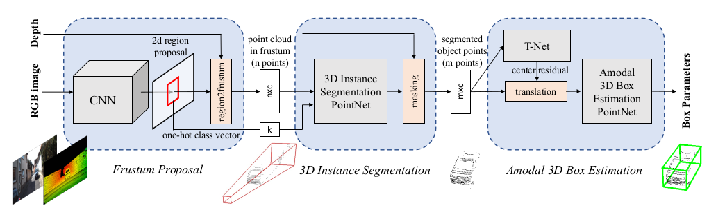
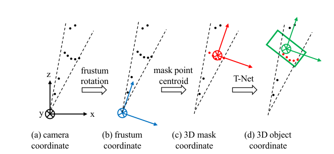
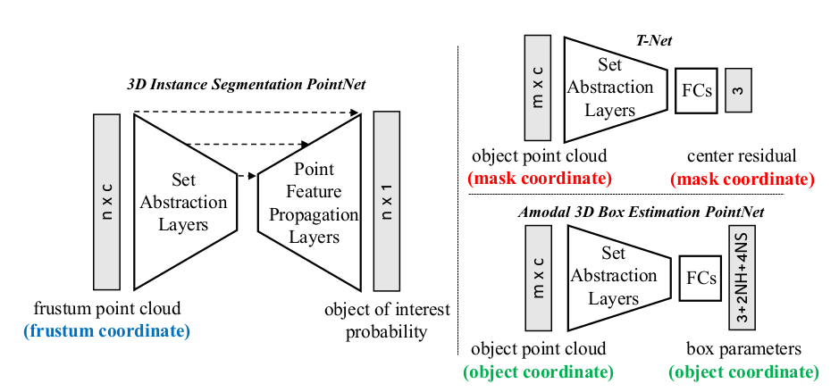

# Frustum_PointNets
## 1. 概述
主要用于解决三维对象检测问题,类比于二维检测问题,首先需要提出proposal。但目前已知三维的提取方法计算复杂度通常与分辨率成三次方增长关系，对于大型场景计算昂贵。不同于之前的工作，他们将RGB-D图像转化为二维图像用CNN处理，而本文将深度图先转化为3D点云后进行处理。

在本论文中，按照降维原理缩小搜索空间：利用成熟的2D物体探测器进行proposal。首先，用图像检测器提取2D边界框来提取对象的3D边界截锥体。然后，在由每个3D截锥体修剪的3D空间内，使用PointNet的两个变体连续地执行3D对象实例分割和非模态（amodal）3D边界框回归。segmentation网络预测感兴趣对象的3D mask（即实例分割)；并用回归网络估计了非模态（amodal）的3D边界框（覆盖整个对象，即使只有部分可见）。

首先，在3D坐标上连续应用了一些变换，这些变换将点云对齐成一系列更受约束和规范的帧。这些对齐变换能分解出数据中的姿势变化，从而使3D几何图案更加明显，从而使3D学习网络的工作更容易。其次，在三维空间中学习可以更好地利用三维空间的几何和拓扑结构。本文作者任务许多几何结构，例如重复，平面性和对称性，在3D空间中更容易参数化和捕获。
## 2. 相关工作
### 2.1 前视图
用单眼RGB图像和形状先验或遮挡模式来推断3D边界框。或将深度图用二维图片处理的方式输入CNN。
### 2.2 鸟瞰图（MV3D）
将LiDAR点云投射到鸟瞰图并训练区域建议网络（RPN）用于3D边界框提议。 然而，该方法在检测诸如行人和骑车者的小物体方面滞后，并且不能容易地适应具有垂直方向上的多个物体的场景。
### 2.3 三维
有的通过SVM或3D CNN在由点云提取的手工设计的几何特征上训练3D对象分类器，然后使用滑动窗口搜索来定位对象。有的转化为体素网格进行空间卷积。但主要问题在于三维的滑窗和卷积计算代价成三次方比，代价太大。

每个物体的参数包含：一个类别参数$k$；一个amodal 3D 边界框（包括尺寸信息$h,w,l$， 中心点$c_x,c_y,c_z$和每个种类相对预定义标准姿势的取向$\theta,\phi,\psi$，但取向我们只讨论heading angle $\theta$）
## 3. Frustum PointNets

如图所示，分为三个部分：frustum proposal；3D instance segmentation；3D amodal bounding box estimation。
首先利用2D CNN物体探测器来提出2D区域并对其内容进行分类。 然后将2D区域提升到3D（projection matrix？），从而成为frustum proposal。 给定frustum中$n×c$的点云，通过每个点的二元分类来对对象实例进行分割。 基于分割后的对象点云（$m×c$），轻量级回归PointNet（T-Net）尝试通过平移对齐点，使得它们的质心接近于amodal box center。 最后，box估计网估计对象的amodal 3D边界框。
### 3.1 Frustum Proposal
由于3D传感器获得的数据分辨率还是不如RGB图像，因此本文利用成熟的二维图像检测来进行权衡。在已知相机投影矩阵的前提下（并且前后平面都由深度传感器的探测距离所得出)，二维的bounding box可以被提升为一个Frustum截锥体。这个锥体就是应该采用三维目标检测的区域，该区域内的点云称为Frustum Point Cloud。由于现在这个锥体有一个初始的偏角，如下图(a)(b)所示，所以需要进行归一化将z轴旋转到中间。（二维BB使用类似于FPN的模型，在ImageNet上预训练后在KITTI 2D数据集上细调）

### 3.2 3D Instance Segmentation
由锥体点云直接预测目标三维位置是一种最直观想法，但是由于物体遮挡(occluding objects)和背景干扰(background clutter)，这样做收益并不大。 本文使用基于PointNet的二元分类进行instance segmentation。由于物体距传感器的距离可能差别很大（5m或50m）如上图(c)所示这里又用到的是相对坐标：预测局部坐标系中的3D边界框中心

PointNet在锥体中预测每个点属于感兴趣对象的可能性，而每个视锥体仅包含一个感兴趣的对象，其他点均为不感兴趣类别。
而在多类detection中，为了进一步利用第一步中二维检测成果，将前一步得到的类别信息编码为one-hot向量，并将其与PointNet中间特征拼接起来。

经过3D Segmentation，得到mask points，而这个点集还需要进一步归一化其坐标以增强算法的平移不变性，如图(c)按质心减去XYZ值，将点云转换为局部坐标，注意这里都没有对点云进行scale的操作，因为部分点云的边界球大小可能会受到视点的极大影响，并且点云的实际大小有助于估计框大小。实验证明这些坐标变换对结果影响很大。

### 3.3 Amodal 3D Box Estimation
#### 3.3.1 3D Alignment by T-Net
接下来需要使用box回归预测amodal oriented 3D bounding box。虽然前面用了各种相对位置但上述最终预测离真实质心还是有一定距离，于是这里使用了一个T-Net（上图右上角）进行进一步的坐标变换。T-Net的架构与PointNet中的STN有点类似，但不同之处在于STN的loss没有直接进行监督训练，而T-Net直接监督loss以控制从mask坐标原点到实际对象中心的中心残差。
#### 3.3.2 Amodal 3D Box Estimation PointNet
经过T-Net对齐后，得到如上上图(d)的点云。然后需要预测BB。该网络与分类网络类似，但最后目标变成了中心$(c_x,c_y,c_z)$尺寸$(h,w,l)$和heading angle$\theta$。仍然采用相对预测预测与中心点之间的残差。绝对中心 = box估计网络预测的中心残差 + T-Net的质心中心残差 + mask质心中心残差。
```mathjax
$$C_{\text {pred}}=C_{\text {mask}}+\Delta C_{t-\text {net}}+\Delta C_{\text {box}-\text {net}}$$
```
而对于尺寸和航向角heading angle，我们遵循二维检测的设置使用分类和回归公式的混合(类似锚点)。 具体来说，我们预先定义 NS尺寸模板 和 NH角度等分盒子 。 模型将同时为尺寸/航向（尺寸打NS个分，航向打NH个分）进行分类，并同时预测每个类别的残差（NH个residual角度和3×NS个residual尺寸） 用于标题）。 于是最后，净输出大小总共为 3 + 4×NS + 2×NH。
### 3.4 多任务联合loss
以上一共提到三个网络(3D instance segmentation PointNet；T-Net；amodal box estimation PointNet)进行联合loss训练。如下公式，其中$L_{c1-reg}$来自T-Net；$L_{c2-reg}$来自BB预测中的中心点回归；$L_{h-cls}$和$L_{h-reg}$来自航向角预测；$L_{s-cls}$和$L_{s-reg}$来自BB尺寸预测；$L_{s-cls}$是Corner Loss下面会提到。

所有的分类上都用到了softmax，所有的回归均使用$l1$ loss。

```mathjax
$$L_{\text {multi-task}}=L_{\text {seg}}+\lambda\left(L_{\text {cl-reg}}+L_{c 2-reg}+L_{h-cls}+L_{h-reg}+L_{s-cls}+L_{s-reg}+\gamma L_{\text {corner}}\right)$$
```
上面提到的loss将中心点，尺寸，航向角三个部分连在了一起，但是这三个部分互相之间没有建立起来联系。假如你中心点和尺寸预测的都比较准确，但是航向角不准，此时会造成IoU小，但是我们的期望是这三个参数同时一起变好，而不是分别优化，所以加了一个Corner Loss如下。
```mathjax
$$L_{\text {corner}}=\sum_{i=1}^{N S} \sum_{j=1}^{N H} \delta_{i j} \min \left\{\sum_{k=1}^{8}\left\|P_{k}^{i j}-P_{k}^{*}\right\|, \sum_{i=1}^{8}\left\|P_{k}^{i j}-P_{k}^{* *}\right\|\right\}$$
```
Corner Loss事实上就是BB的八个角点的预测值与真值之间的距离，这样就将中心点，尺寸，航向角三项都关联起来了。

为了计算Corner Loss，首先从从所有的 尺寸模板 和 航向角等分盒子 建立 NS×NH 的anchor box然后将锚箱转换到估计的箱子中心。