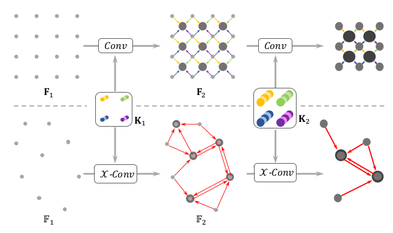
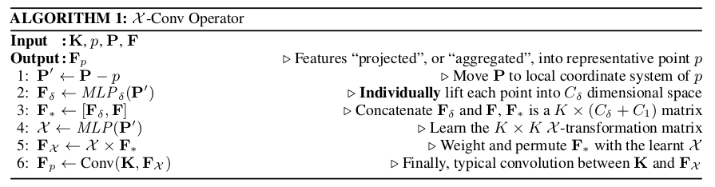
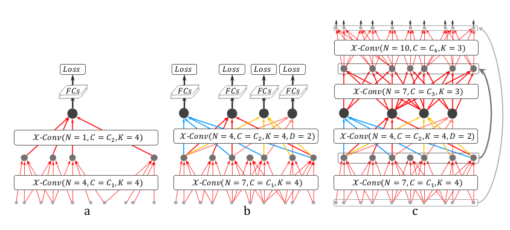

# PointCNN
本文想在卷积网络的基础上进行改进。但直接对点云数据无法进行卷积，传统卷积会造成点云形状信息丢失与点云排序带来的误差。


于是本文主要任务是学习一个对K个输入点$(p_1, p_2,...,p_k)$的K\* K $\chi-transformation=MLP(p_1, p_2,...,p_k)$（后面用X-Trans代替）以避免前述问题。这样同时对输入特征进行加权和排序，然后对变换后的特征进行经典的卷积。这里说的X-Trans得到的便是K\* K的变换矩阵$\chi$。这样，如上图学自不同的点集（ii和iii）得到的矩阵可以不同，来自同一点集，不同排列顺序的只要满足$X_{iii} = X_{iv}\times \Pi$其中$\Pi$表示从排列(c, a, b, d) 到 (a, b, c, d)的初等变换矩阵，这样就有$f_{iii}=f_{iv}$。
## 架构
### 层次卷积

PointCNN的输入是$\mathbb{F}_1=\{(p_{1,i}, f_{1,i}):i=1,2,...,N_1\}$其中$p_{1,i} ∈\mathbb{R}^{Dim}$表示的是位置信息,$f_{1,i} ∈\mathbb{R}^{C1}$表示的是特征信息。$\mathbb{F}_2=\{(p_{2,i}, f_{2,i}):i=1,2,...,N_2\}$，同卷积操作一样，操作后N数量变少，feature的深度变大。从$p_{2,i}$到$p_{1,i}$在分类网络中是通过随机下采样决定的，在分割任务中采用的是最远点采样，因为分割任务更需要点的均匀分布。作者认为这里的下采样方式的提高可能提高网络能力。
### X-Conv operator
$X$-Trans是由$\mathbb{F}_{1}$到$\mathbb{F}_{2}$的关键步骤。先列出操作公式：
```mathjax
$$\begin{aligned} \mathbf{F}_{p} &=\mathcal{X}-\operatorname{Conv}(\mathbf{K}, p, \mathbf{P}, \mathbf{F}) \\ &=\operatorname{Conv}\left(\mathbf{K}, \operatorname{MLP}(\mathbf{P}-p) \times\left[M L P_{\delta}(\mathbf{P}-p), \mathbf{F}\right]\right) \end{aligned}$$
```
其中$p$指采样后的$N_2$个点中的某一个，该点带有的feature为$f$。由于$X$-Conv也是模仿卷积的原理，要用到局部特征，将点$p$最近邻的K个点记为邻域$\mathbb{N}$。这样X-Conv的输入（个人理解输入即采样后某中心点的K邻域）便可记为$\mathbb{S}=\left\{\left(p_{i}, f_{i}\right): p_{i} \in \mathbb{N}\right\}$。注意$\mathbb{S}$是个无序集。不失一般性地：$\mathbb{S}$ 可投射成K × Dim 矩阵 $\mathbf{P}=(p_1,p_2,...,p_K)^T$ 和K × C~1~ 矩阵 $\mathbf{F}=(f_1,f_2,...,f_K)^T$

$M L P_{\delta}$是类似PointNet的单独应用于每个点上的多层感知机， × 是指矩阵乘法，$\mathbf{K}$是Kernel。

整个公式详解如上，解释如下。
1. Normalize，整个$\mathbb{N}$局部特征不应依赖于$p$点的位置信息；
2. 逐点提取特征，$\mathbf{P}$将坐标信息提取到与特征信息$\mathbf{F}$相同维度上，这样相当于得到形状特征；
3. 结合坐标特征与原有的特征（直接堆叠concatenate）；
4. 用归一化后的坐标点进行MLP得到之前所述K\* K的变换矩阵$\mathcal{X}$；
5. 用变换矩阵对3. 获得的特征进行加权和重新排布；
6. 最后便可以应用传统卷积。

PointNet中也是对点云进行逐个MLP提取特征，不同在于坐标特征提取完以后，PointNet使用对称函数（有丢失信息的风险）而本文则是将特征一起拿来卷积。
### 架构
本文的X-Conv和传统卷积运作方式相似，差别在于：
1. 提取局部区域的方式(CNN中的K×K区域 与 PointCNN中代表点周围的K个邻近点)
2. 对于局部区域的信息学习方式(CNN的Conv 与PointCNN中的X-Conv)。


将每个代表点的感受野定义为比率K / N，其中K是相邻点的数目，N是前一层中的点的数目，这样的定义可以使得如图a的分类网络中最后一个输出点的感受野为1.0。（注：CNN中感受野定义为一个神经元能看到的视野，这里也是类似，但是在视野的基础上）但(a)中PointCNN的顶层X-Conv层的训练样本数量迅速下降，使得彻底训练顶层X-Conv层的效率很差。改进则是图 b 所示，保留了更多表示点。目的是在保证网络深度的同时希望保证感受野比率的增长，使得更深层的表示点“看到”整个形状的越来越大的部分。另外这里用到了传统CNN中空洞卷积（dilated conv不通过pooling也能有较大的感受野看到更多的信息）的思想。设置一个dilation rate: D，不同于 a 中每次取K近邻点进行X卷积，而是每次取K\*D个点。然后从中均匀采样K个点进行卷积。这样，感受野便可以从 K/N 提升到 (K\*D)/N
在 b 的第二个X-Conv层中，使用了D = 2，因此剩下的所有四个代表点“看到”整个形状，并且它们都适合做出预测。通过这种方式，与 a 的PointCNN相比，我们可以更彻底地训练顶层X-Conv层，因为网络涉及更多的连接。在测试时，多个代表点的输出在softmax之前进行平均，以稳定预测结果（如Network in Network的设置）。
而图 c 所示为分割任务网络架构，使用卷积-反卷积架构，其中的反卷积也是由X-Conv计算得来的：使输出中的点数比输入点中的点数多，但特征通道少。
在全连接层前还用了dropout避免过拟合。还采用了“子体积监督（Subvolume supervision）”理念来解决过拟合问题。在最后的X-Conv层中，感受野被设置为小于1，使得最后的X-Conv层中的代表点仅“看到”部分信息。在训练时促使网络更加深入了解局部信息，并在测试时表现更好。不过在这种情况下，点的全局坐标（而不是相对坐标）就会有影响。这里的做法是将全局坐标用一个MLP转化为feature空间中。

数据增广：对于X-Conv中的参数的训练，如果相邻点对于特定代表点始终是相同顺序的相同集合，是很不利的。为了提高可推广性，我们提出随机抽样和打乱输入点，使得相邻点集和顺序可能因批次不同而不同。为了训练以N个点为输入的模型，应有$\mathcal{N}\left(N,(N / 8)^{2}\right)$个点用于训练，其中N表示高斯分布。