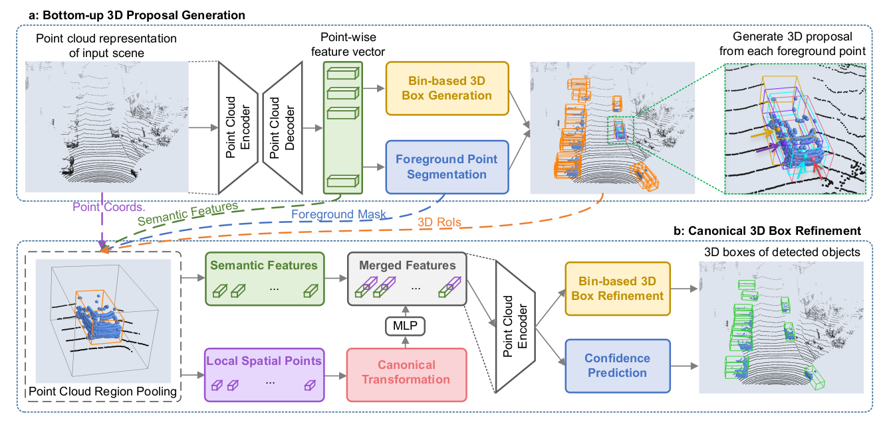
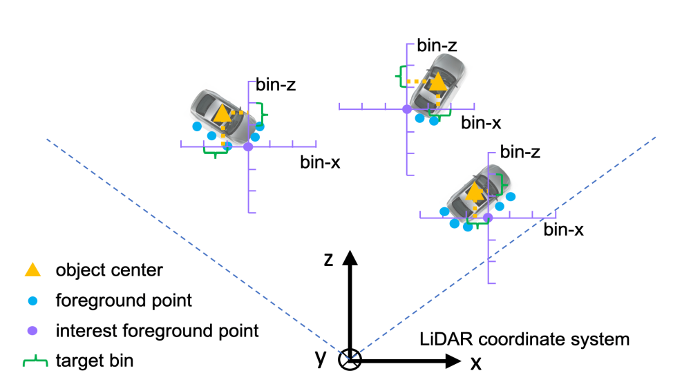
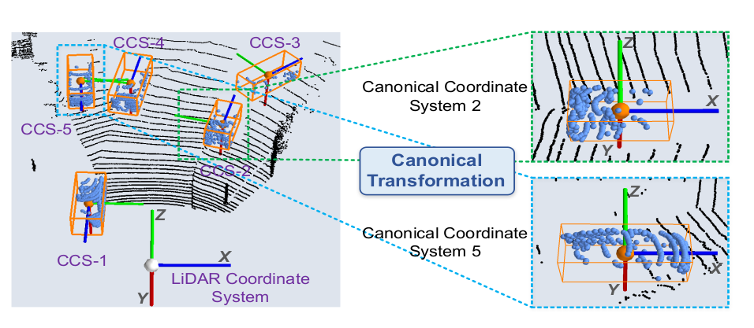

# PointRCNN
两步法：第一步自底向上的3D proposal；第二步在proposal基础上进行优化得到标准坐标系下BB结果。创新之处在于，第一阶段不使用2D图像、鸟瞰图或体素等方法，直接由三维点云分割为前景点和后景点并由此产生一系列的BB（相当于anchor box）来进行3D proposal。来自分割所学习的表示点不仅利于生成提案，而且对后面的Box优化也有帮助。
提出的规范3D边界框使用了一阶段生成的高召回框提案，并在带有高鲁棒性的基于区域的损失的规范坐标中学习优化框坐标。
## 架构
第一阶段的proposal主要基于所有点云的全景segmentation。因为三维情况下不同于二维的是不会有重叠，所以所有三维分割得到的某一mask理应被包含于一个BB里。于是就可以通过点云原数据的分割，推测出3D proposal，这样可以避免预定义大量三维锚盒。

### 1. 基于分割的3D proposal
#### 学习点云表示（point cloud representation）
利用Pointnet++ MSG作为backbone提取segmentation特征。对于提取的特征，同时进行两个操作：前景点分割和3D BB proposal
#### 前景点分割
由于前景点的数量在大型户外数据集中肯定是远少于背景点的，所以在这里采用了focal loss来平衡这种类间不平衡问题。
```mathjax
$$
\begin{array}{l}{\mathcal{L}_{\text {focal }}\left(p_{t}\right)=-\alpha_{t}\left(1-p_{t}\right)^{\gamma} \log \left(p_{t}\right)} \\ {\text { where } p_{t}=\left\{\begin{array}{ll}{p} & {\text { for forground point }} \\ {1-p} & {\text { otherwise }}\end{array}\right.}\end{array}
$$
```
训练过程中设置$\alpha_t=0.25,\gamma=2$
#### Bin-based 3D bounding box generation
仍然采用分割的特征，回归到3D BB。虽然是利用前景点生成的BB，但由于感受野的原因，背景点也有其贡献。BB的参数主要包括$(x,y,z,h,w,l,\theta)$。
提出了bin-based regression loss来对proposal进行约束。

预测中心点时，如上图示，将每个前景点的周围区域分割成一系列离散的bin。也就是说以每个前景点为坐标原点，x,z轴方向设立一个搜索范围$S$，并将其平均分为同样长度$\delta$的bin来表示不同的物体中心$(x,z)$。这样基于bin的交叉熵损失分类比而不是直接L1损失回归更为准确和鲁棒。（个人理解是先分类选择中心点应该落在的bin，再回归在bin中的残差）

X，Z的定位损失包含两项。一项是沿X，Z轴的bin分类；一项是在已分类bin基础上的残差回归。另外。Y方向上的中心直接利用smooth L1进行回归，因为大多数物体的 y 值一般较小。
```mathjax
$$\begin{aligned} \operatorname{bin}_{x}^{(p)} &=\left\lfloor\frac{x^{p}-x^{(p)}+\mathcal{S}}{\delta}\right\rfloor, \operatorname{bin}_{z}^{(p)}=\left\lfloor\frac{z^{p}-z^{(p)}+\mathcal{S}}{\delta}\right\rfloor \\
\operatorname{res}_{u}^{(p)} &=\frac{1}{\mathcal{C}}\left(u^{p}-u^{(p)}+\mathcal{S}-\left(\operatorname{bin}_{u}^{(p)} \cdot \delta+\frac{\delta}{2}\right)\right) \qquad\text{u} \in\{x,z\}\\
\operatorname{res}_{y}^{(p)} &=y^{p}-y^{(p)} \end{aligned}$$
```
其中
$(x^{(p)},y^{(p)},z^{(p)})$是感兴趣的前景点坐标，
$(x^{p},y^{p},z^{p})$是对应目标的中心点坐标，
$\operatorname{bin}_{x}^{(p)},\operatorname{bin}_{z}^{(p)}$是沿X，Z轴分配的真值bin
$\operatorname{res}_{x}^{(p)},\operatorname{res}_{z}^{(p)}$是在分配bin中的真值残差，
$C$是用于归一化的bin长度

对于朝向角$\theta$，将$2\pi$的朝向分为n个bin，同样计算分类目标$\operatorname{bin}_{\theta}^{(p)}$和残差$\operatorname{res}_{\theta}^{(p)}$

而尺寸$(h,w,l)$则直接回归计算与每个类平均物体尺寸的残差$(\operatorname{res}_{h}^{(p)},\operatorname{res}_{w}^{(p)},\operatorname{res}_{l}^{(p)})$

而在推理阶段，基于bin的预测参数$x,z,\theta$，首先选最大预测置信度的bin center，并将预测残差加进去；而直接回归的值则直接在初始值基础上加上残差。
训练过程中总体的3D BB回归loss如下
```mathjax
$$
\begin{aligned} 
\mathcal{L}_{\text {bin }}^{(p)} &=\sum_{u \in\{x, z, \theta\}}\left(\mathcal{F}_{\text {cls }}\left(\widehat{\operatorname{bin}}_{u}^{(p)}, \operatorname{bin}_{u}^{(p)}\right)+\mathcal{F}_{\text {reg }}\left(\widehat{\operatorname{res}}_{u}^{(p)}, \operatorname{res}_{u}^{(p)}\right)\right) \\ 
\mathcal{L}_{\text {res }}^{(p)} &=\sum_{v \in\{y, h, w, l\}} \mathcal{F}_{\text {reg }}\left(\widehat{\operatorname{res}}_{v}^{(p)}, \operatorname{res}_{v}^{(p)}\right) \\ 
\mathcal{L}_{\text {reg }} &=\frac{1}{N_{\text {pos }}} \sum_{p \in \text { pos }}\left(\mathcal{L}_{\text {bin }}^{(p)}+\mathcal{L}_{\text {res }}^{(p)}\right) 
\end{aligned}
$$
```
其中$N_{pos}$是前景点数量；
$\widehat{\operatorname{bin}}_{u}^{(p)}$和$\widehat{\operatorname{res}}_{u}^{(p)}$是预测值；
$\operatorname{bin}_{u}^{(p)}$和$\operatorname{res}_{u}^{(p)}$是真值；
$\mathcal{F}_{\text {cls}}$是分类交叉熵损失，$\mathcal{F}_{\text {reg}}$是smooth $L1$

为了减少多余的proposal，对鸟瞰图IoU使用NMS。训练时设定IoU阈值为0.85.经过NMS后，保留前300个proposal用于第二阶段训练。推理时这两个数字分别为0.8和100。
### 2. 点云区域池化
由于下一阶段需要进一步优化定位信息，需要得到更详细的局部特征。所以这里需要一个池化的结构。

对于每一个proposal，$\mathbf{b}_{i}=(x_{i},y_{i},z_{i},h_{i},w_{i},l_{i},\theta_{i})$，将其稍微扩大为$\mathbf{b}_{i}^{e}=(x_{i},y_{i},z_{i},h_{i}+\eta, w_{i}+\eta,l_{i}+\eta,\theta_{i})$来从背景中提取出一些额外信息。对于每一个点，判断其是否落在这个扩大过后的proposal中，若在其中，则将其特征（包括位置特征$(x^{(p)},y^{(p)},z^{(p)})\in\mathbb{R^3}$，激光反射信息$r^{(p)}\in\mathbb{R}$，前一阶段预测的mask$m^{(p)}\in\{0,1\}$，和C维点云学习到的表示$f^{(p)}\in\mathbb{R}^C$）保留。其中$m^{(p)}\in\{0,1\}$主要用于判断proposal中的点是否是前景点。如果一个proposal中没有点，则直接删除这个proposal。
### 3. 规范3D边界框优化
#### 规范坐标转化

为了利用第一阶段得到的高召回率proposal，并只预测盒子参数的残差，将池化后proposal中的点转化到相对于proposal的坐标中变为$\tilde{p}$。原点变为proposal中心点，Ｘ轴方向为物体heading方向且平行于水平面，Y轴不变。这样的转化需要合理的平移和旋转操作。
#### 特征学习
前面2.里说到的点坐标变成了上一节说的规范坐标模式，但是这样的坐标丢失了各个proposal之间的关系，所以这里加入了一个参数$d^{(p)}=\sqrt{\left(x^{(p)}\right)^{2}+\left(y^{(p)}\right)^{2}+\left(z^{(p)}\right)^{2}}$到点$p$的特征中。

这样，到此为止，proposal中每个点的特征就包括$\tilde{p}，[r^{(p)},m^{(p)},d^{(p)}]，f^{(p)}$。自然这里有维度不同的问题，首先将$\tilde{p}，[r^{(p)},m^{(p)},d^{(p)}]$拼接在一起然后放入数层全连层来升维到$f^{(p)}$的空间。然后将这样的局部信息和全局信息$f^{(p)}$拼接在一起送入接下来的用于分类置信度和box优化的网络来获得特征向量。
#### proposal优化损失
当真值与proposal的IoU超过0.55时，便将这个真值赋给该proposal。这里要注意真值也要转化到规范坐标系中，也就是说，proposal参数变为$\tilde{\mathbf{b}}_{i}=(0,0,0, h_{i}, w_{i}, l_{i}, 0)$，真值参数变为$\tilde{\mathbf{b}}_{i}^{\mathrm{gt}} =(x_{i}^{\mathrm{gt}}-x_{i}, y_{i}^{\mathrm{gt}}-y_{i}, z_{i}^{\mathrm{gt}}-z_{i}, h_{i}^{\mathrm{gt}}, w_{i}^{\mathrm{gt}}, l_{i}^{\mathrm{gt}}, \theta_{i}^{\mathrm{gt}}-\theta_{i})$
训练中第$i$个proposal的位置目标同前，也是这么设置的：$\left(\operatorname{bin}_{\Delta x}^{i}, \operatorname{bin}_{\Delta z}^{i}, \operatorname{res}_{\Delta x}^{i}, \operatorname{res}_{\Delta z}^{i}, \operatorname{res}_{\Delta y}^{i}\right)$；不同之处在于这里由于需要进一步优化定位信息，所以选用的搜索区域$S$较前面的小。同样直接回归相对于该类别平均物体尺寸的残差$\left(\operatorname{res}^{i} \Delta h, \operatorname{res}_{\Delta w}^{i}, \operatorname{res}_{\Delta l}^{i}\right)$
对于取向