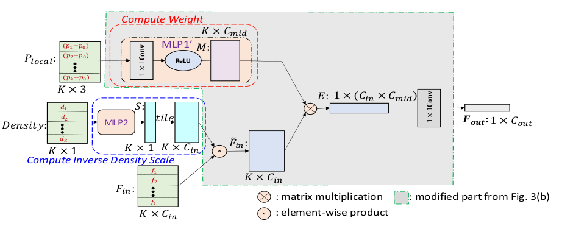
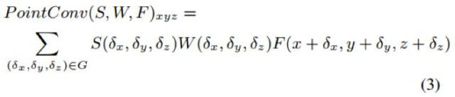

# PointConv

总体结构如上图所示，其主要贡献在于新的卷积实现。其卷积将点的出现概率考虑进去：

其中 S 表示的是逆密度函数，在其代码中，某个点的相应逆密度是利用其距离其他所有点的距离的高斯分布后的值的平均值，然后经过MLP得到。
W 是权重函数，可以单纯通过将点的相对位置输入一个MLP得到
代码中表现出来的其 密度 与 特征 之间的乘法是广播后的元素间相乘，而与 权重 的乘法则是矩阵乘。