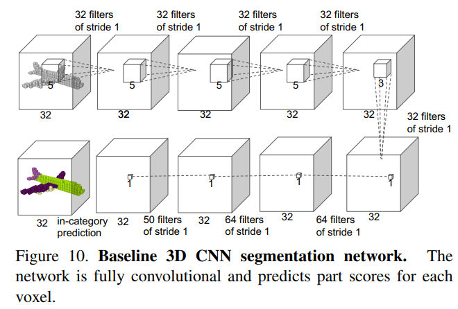

# PointNet
由于点云数据的特殊性，之前的大多数研究将点云划分为体素，但这样会使数据不必要的变大。
本文直接输入点云，充分重视其置换不变性（permutation invariance)，利用对称函数（max pooling）解决。文中使用经验和理论方法证明了该方法可用于近似任何连续函数。更有趣的是，本网络大概学到的是点云中的关键点（点云的稀疏表示集），类似于骨架，因而该架构对噪音比较鲁棒。

由于点云很容易进行刚性或者仿射变换，为了提高效果，在输入PointNet之前加了一个data-dependent空间变换网络。

# R^n^空间上点云的性质
1. 无序性。点集没有顺序，n个点就有n!种排列组合；
2. 局部相互作用。点集是来自距离度量的空间，近邻的点有相互作用关系，能构成有意义的子集，需要挖掘近邻点的局部信息；
3. 不变性。部分点集是一个整体，因此通过某些变换后需要保持其不变性。
# 架构
主要包括：用于聚合信息的对称函数max pooling，局部和全局信息聚合结果，两个用于对齐输入点和点特征的联合对齐网络

## 对称函数
主要有三种应对无序性的方法：
1. 以某种典型的顺序排序。但在高维空间中并不存在这样的排列方法；
2. 将输入看做序列输入RNN。但RNN能处理的无序性只是在小范围序列内，序列太长的时候顺序还是有影响的；
3. 用对称函数聚合信息。

对称函数是将n个向量作为输入，输出一个新的具有不变性的向量的操作。
```mathjax
$$
f\left(\left\{x_{1}, \ldots, x_{n}\right\}\right) \approx g\left(h\left(x_{1}\right), \ldots, h\left(x_{n}\right)\right)
$$
```
其中，h表示从$\mathbb{R}^{N} \rightarrow \mathbb{R}^{K}$的映射，g则是$\underbrace{\mathbb{R}^{K} \times \cdots \times \mathbb{R}^{K}}_{n} \rightarrow \mathbb{R}$到实数域的对称函数映射。
在PointNet应用中，使用一个多层感知机近似 $h$；使用一个单变量函数和一个max pooling的组合近似 $g$。通过一系列h，可以学到f的组合用于捕获数据集的不同性质。
## 局部和全局信息聚合
上述操作输出为$\left[f_{1}, \ldots, f_{K}\right]$的全局特征，适用于分类问题。但在语义分割等需要局部信息的任务中则需要聚合局部信息。

解决方案是如图所示，用拼接的方式将全局特征和每个点的特征。这样构成新的每个点特征。
## 联合对齐网络
用于保证点云经过一定变换（刚性）之后的不变性。一个自然的想法就是讲点云投射到一个规范的空间。通过一个小网络（图中的T-net，由全连接和pooling组成）预测一个仿射变换矩阵，然后直接把这一变换应用到输入点上。这部分的灵感来自于：M. Jaderberg, K. Simonyan, A. Zisserman, et al. Spatial transformer networks.

同样的，这种想法还能用到特征空间的对齐上，但不同之处在于，特征空间往往是高维度的，会增加优化的难度，因此在softmax训练损失上加入了正则化项，约束特征对齐矩阵为正交阵（正交阵$A A^{T}=I$）：    $L_{r e g}=\left\|I-A A^{T}\right\|_{F}^{2}$    其中A则为T-net预测的特征对齐矩阵。这是因为正交阵的变换不会引起信息的丢失。
## 架构补充详解

### 分类网络
第一个转化网络是一个mini PointNet，接受原始点云数据（n\*3）回归输出一个3\*3矩阵，如第一个虚线框所示。该网络是一个（64,128,1024）的共享MLP+每个点的max pooling+两个（512，256）全连接层。这个输出矩阵初始化为$I$，除最后一层，所有层都有ReLU和BN。最后得到的变换矩阵是每一个sequence有一个。

第二个T-Net结构与第一个类似，但输出是64\*64矩阵，还加入了系数0.001的正则项。

在tf代码中，mlp的前面这几层操作都是当做共享权重的卷积处理的，第一层卷积核大小是1x3（因为每个点的维度是xyz），之后的每一层卷积核大小都是1x1。

最后的全连层（应该说的是输出class prediction前的最后一个）前用keep_ratio=0.7的dropout。
### 语义分割
前文一直说的局部点特征指的是第二个T-Net后的输出，全局特征是max pooling的输出。语义分割没有用dropout。这里个人猜测拼接方法是将全局特征重复了n次。

本架构是用于part segmention的改进架构，拼接特征结合了前几层的特征，还加了一个分类标签的one hot向量。
### 补充一个3D语义分割全卷积网络

1. 将点云分割为32\*32\*32的体素表示
2. 用5层输出通道数为32的3\*3\*3三维卷积进行特征提取（每个体素感受野为19）
3. 用1\*1\*1卷积核预测语义标签

除最后一层，同时用了ReLU和BN。