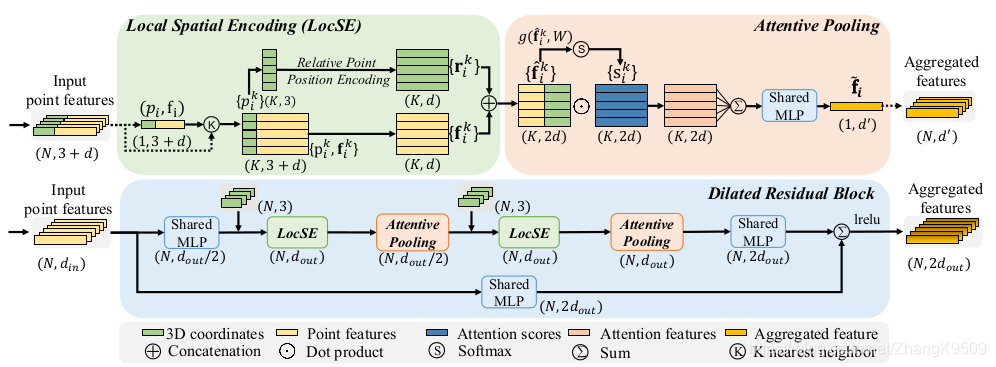
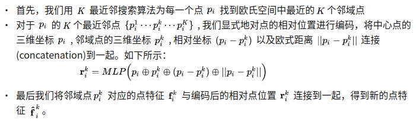
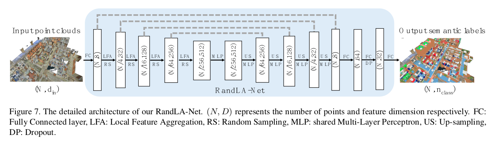

# RandLA-Net
2020 CVPR oral 用于分割


文章的动机主要来源于对PointNet等结构的反思。在将 PointNet 分割后的结果可视化以后，发现其中有很多将同一物体切分成不同物体的问题。这时因为在预处理切块的时候就已经把一个物体切分成几个小的点云块，而后再分别不相关地地输入到网络中。也就是说，在点云目标几何结构已经被切块所破坏的前提下，网络是难以有效地学习到桌子的整体几何结构的。

创新在于新的三个结构：
## 局部空间编码 Local Spatial Encoding
此模块用于显式地对输入的点云的三维坐标信息进行编码。不同于直接将各个点的三维坐标作为一个普通的通道特征输入到网络中，LocSE模块旨在显式地去编码三维点云的空间几何形状信息，从而使得网络能够从各个点的相对位置以及距离信息中更好地学习到空间的几何结构。
步骤：

```python
concat = torch.cat((
            center_coords,        # (B, 3, N, K)
            neighbors,              # (B, 3, N, K)
            center_coords - neighbors,
            dist.unsqueeze(-3)      # (B, 1, N, K)
        ), dim=-3).to(self.device)
return torch.cat((self.mlp(concat), features.expand(B, -1, N, K)), dim=-3)
```
## Attentive Pooling
此模块用于将上述单元输出的邻域点特征集聚合到一起。现有的大多数算法通常采用启发式的max/mean/sum pooling来 hard integrate 邻域点特征集，这样做有可能导致许多有用的信息被丢失。不同于此，我们希望通过注意力机制来自动学习和聚合邻域点特征集中有用的信息。具体来说，对于一个邻域特征点集合 ，我们首先设计一个共享函数 g 来为每一个点学习一个单独的attention score，
$s_{i}^{k}=g(f_{i}^{k},W)$其中 g 是共享MLP的可学习参数。然后，我们将学习到的attention score视作一个能够自动选择重要特征的soft mask，最终得到的特征是这些邻域特征点集的加权求和，如下所示:$f_{i}^{k}=\sum\limits_{k=1}^{K} (f_{i}^{k}·s_{i}^{k})$
## 扩张残差块 Dilated Residual Block
考虑到输入的点云会被持续大幅度的降采样，因此显著地增加每个点的感受野是非常有必要的。换句话来说也就是，我们希望即便RandLA-Net随机地丢弃某些点的特征，输入点云的整体的几何细节也能够被保留下来。基于这样一个想法，我们将多个LocSE，Attentive Pooling以及skip connection连接在一起组成扩张残差块(Dilated Residual Block)。相比于直接增大K最近搜索中的K值而言，这是一种更加廉价高效的方式来增大每个点的感受野以及促进邻域点之间的feature propogation。通过后面的消融实验，我们的扩张残差块最终使用两组LocSE和attentive pooling单元，以平衡最终的分割性能以及计算效率。

最后，我们将随机采样以及局部特征聚合模块组合到一起，基于标准的encoder-decoder结构组建了RandLA-Net。网络的详细结构如下图所示，可以看到，输入的点云在RandLA-Net中持续地进行降采样以节约计算资源及内存开销。此外，RandLA-Net中的所有模块都由简单高效的feed-forward MLP组成，因此具有非常高的计算效率。最后，在解码器中的上采样阶段，不同于广泛采用的三线性插值(trilinear interpolation)，我们选择了更加高效的最近邻插值(nearest interpolation)，进一步提升了算法的效率。
