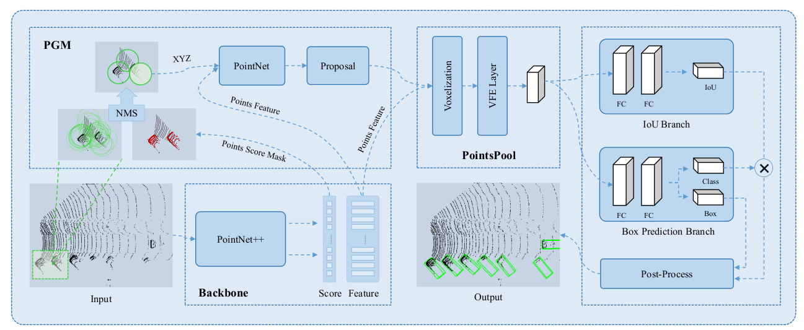

# STD:Sparse to Dense
两阶段:第一阶段以每个点为基础预测椭圆anchor，这样主要是想保留每个点的局部信息。对每个产生的提议特征使用PointsPool来将稀疏的内在点特征转化到高维特征空间中去。增加IoU预测支路。

## Framework
### 1. Proposal Generation
本方法的挑战之一来自于由于从每个点出发选取anchor，由于原始点的数量庞大，所以不可避免的会产生多余的redundancy，于是在推理和训练的时候会比较耗计算量。在赋予标签的时候也需要特殊设计。
#### 球形anchor
相较于传统的方形anchor，球形anchor的优点在于没有取向性，可以指向空间内任一方向。
球形anchor的感受野由半径参数决定，而这个半径参数是与目标分类有关的（不同类别的半径不同）。这样，由每个anchor所预测出来的proposal是基于球形anchor感受野中的点所推理出来的。每个球形anchor对应一个预设好尺寸的参考目标框用于proposal生成。而且anchor没有预设的方向，而是通过预测产生。因而球形anchor的数量与预先定义的参考框可能方向的数量不成正比，使得anchor数量减少约50%。


左边是给予PointNet++的语义分割网络，右边是基于Pointnet的区域推荐网络。

为了进一步压缩anchor数量，对每个点使用三维语义分割网络（PointNet++）来预测其种类和语义特征。然后使用非极大值抑制（NMS）去除冗余。最终每个anchor的分数是中心点的语义分割分数。而在NMS中的IoU则是将anchor投影到鸟瞰图方向上以后计算的。
#### Proposal Generation Network
对于anchor中的点，将其语义特征和归一化后的位置坐标（X,Y,Z）传入一个PointNet中以预测分类分数，回归的offset以及空间取向。
根据回归得到的offset，结合原有的anchor中心位置$(A_x, A_y, A_z)$，预先定义的尺寸$(A_w, A_h, A_l)$便可获得proposal的基本参数。而取向角度的预测则结合了Frustum PointNets，也就是把所有角度平均分为$N_{\alpha}$个angle bin（本文设为12），再对proposal进行分类找出所在的bin，最后回归残差。最后，基于分类分数和鸟瞰图IoU使用NMS减少冗余。本文中保证至少训练时300 proposal，测试时100 proposal。

#### Assignment Strategy
由于传统标签中真值还是方形的，不同于我们的球形anchor，所以不能传统的IoU计算方式来决定label的决定方式。于是本文提出了PointsIoU来给目标标签赋值。
PointIoU=（属于anchor与ground truth box相交部分的点的数量）/（属于anchor与ground truth box相并部分的点的数量）当这个值大于0.55的时候，anchor被认为是正标签。
### 2. Proposal Feature Generation
这一步主要利用之前获得的proposal和语义特征来构建更密集的特征。最简单的方法是直接在proposal内点的基础上使用PointNet++。但这样做的计算量比较大，因而提出了体素化层PointsPool，这样可以更高效的利用FC层。
#### PointsPool层
1. 随机选取proposal内部N个点，将其位置信息和语义特征作为初始特征输入，其中位置特征由原坐标减去中心点坐标后，旋转到proposal预测的角度上去。
2. 使用体素化层将每个proposal等距划分为$d_l, d_w, d_h$体素（本文划分为6\*6\*6的体素网格）。在每个体素中随机采样$N_r=35$个点，将这些点的位置和语义特征拼接起来代表每一个体素。这样的体素表示梯度是可传导的，因而可以直接端到端训练。
3. 最后使用一个通道数为(128,128,256)的Voxel Feature Encoding (VFE)层来提取每个体素的特征，这样每个proposal产生的特征就是$(d_l, d_w, d_h, 256)$.这样将特征拉平以后就能送入后面用于预测box的FC层了
### 3. Box Prediction Network
主要有两个分支，一个是box estimation，一个是IoU估计。
#### box estimation
用两个(512,512)的FC层先提取整体proposal特征，再分别接两个用于分类和回归的FC层。直接回归尺寸offset$(t_l, t_w, t_h)$和中心点偏移$(t_x, t_y, t_z)$，角度仍然是如上融合了分类与回归的方法。
#### IoU estimation
预测box与真值间的IoU再将其乘以分类分数，这样得到的新分数用于NMS。训练时IoU支路只在标签为正的时候才计算。
### 4. 损失函数
主要分为两个部分：
```mathjax
$$L_{\text {total}}=L_{\text {prop}}+L_{\text {box}}$$
```
1. 其中proposal产生的loss是语义分割和proposal prediction的和。语义分割采用focal loss，参数$\alpha_t=0.25,\gamma=2$。其他具体如下
```mathjax
$$\begin{aligned} L_{\text {prop}} &=L_{\text {seg}}+\frac{1}{N_{\text {cls}}} \sum_{i} L_{\text {cls}}\left(s_{i}, u_{i}\right) \\ &+\lambda \frac{1}{N_{\text {pos}}} \sum_{i}\left[u_{i} \geq 1\right]\left(L_{\text {loc}}+L_{\text {ang}}\right) \end{aligned}$$
```
$s_{i}, u_{i}$分别是对于anchor $i$的预测分类分数和真值标签；
$N_{cls}, N_{pos}$分别是对于anchor数量和正标签数量；
$\left[u_{i} \geq 1\right]$是指示函数，大于1时值为1，其他时候为0；
$L_{\text {cls}}$采用交叉熵损失；
$L_{\text {loc}}$包括以下部分（其中A表示anchor，G表示真值，$L_{\text {dis}}$采用$smooth-l_1$损失）：
```mathjax
$$
L_{l o c}=L_{d i s}\left(A_{c t r}, G_{c t r}\right)+L_{d i s}\left(A_{s i z e}, G_{s i z e}\right)\\
\left\{\begin{aligned}
G_{c t r} &=& G_{j}-A_{j}, & j \in(x, y, z) \\
G_{s i z e} &=&\left(G_{j}-A_{j}\right) / A_{j}, & j \in(l, w, h)
\end{aligned}\right.
$$
```
$L_{\text {ang}}$包括分类损失和残差预测损失(t表示预测值，v表示目标值)：
```mathjax
$$
L_{\text {angle}}=L_{\text {cls}}\left(t_{a-c l s}, v_{a-c l s}\right)+L_{d i s}\left(t_{a-r e s}, v_{a-r e s}\right)
$$
```
2. box prediction loss与上述类似，只是加了两个多的部分：3D IoU loss和corner loss
3D IoU loss来自于IoU分支，计算的是proposal与对应真值的IoU，损失函数使用$smooth-l_1$；
corner loss如下，是预测的8个角与真值8个角的距离。
```mathjax
$$L_{\text {corner}}=\sum_{k=1}^{8}\left\|P_{k}-G_{k}\right\|
$$
```
