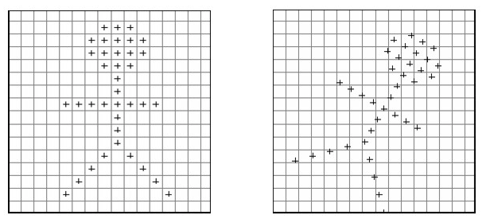

# 双线性插值
## 仿射变换
包括平移、缩放、旋转、剪切等操作
```mathjax
$$
\left(
\begin{matrix}
x'  \\
y' 
\end{matrix}
\right)=
\left(
\begin{matrix}
 a & b & c \\
d & e & f 
\end{matrix}
\right)
\left(
 \begin{matrix}
x \\
y \\
1
\end{matrix}
\right) 
$$
```
## 双线性插值
在对图像进行仿射变换时，会出现一个问题，当原图像中某一点的坐标映射到变换后图像时，坐标可能会出现小数，而我们知道，图像上某一像素点的位置坐标只能是整数，那该怎么办？这时候双线性插值就起作用了。 


根据某点周围4个位置的值加权平均得到该点值
```mathjax
$$
R_1=\frac{x_2-x}{x_2-x_1} Q_{11}+\frac{x-x_1}{x_2-x_1} Q_{21}\\ 
R_2=\frac{x_2-x}{x_2-x_1} Q_{12}+\frac{x-x_1}{x_2-x_1} Q_{22}\\
P=\frac{y_2-y}{y_2-y_1} R_{1}+\frac{y-y_1}{y_2-y_1} R_{2}
$$
```

