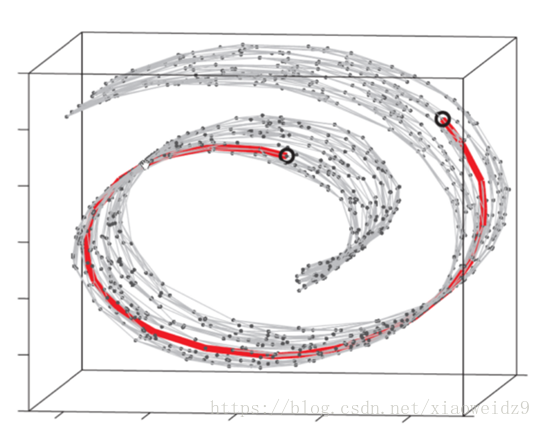
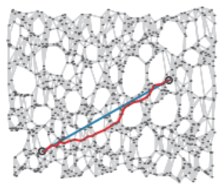

# ISOMAP
基于MDS的基础上，对距离度量进行了改进，将欧氏距离换成了测地距离  
一个直观的例子：  
  
此图中，两点间距离不能用简单的欧氏距离来拟合，而应该是沿高维空间方向上的测地线来拟合。流形上两点之间距离最短的线是测地线！  

那么问题来了，如何寻找测地线？  
对每个点基于欧氏距离找出近邻点，然后就能建立一个近邻连接图，于是整个问题转化成计算近邻连接图上两点间最短路径(Dijkstra/Floyd算法)的问题。
展平：  
  
上图中蓝线为真实测地距离，红线为用近邻点拟合的测地距离。  
  
## 算法过程：  
**输入：**样本集{x~1~,······,x~m~}，近邻参数k，低维空间维度d'  
1. 
```
1. for i = 1:m：
        确定x~i~的k近邻；
        设置其与K近邻点间距离为欧氏距离，其他点为无穷大
2. 用最短路径算法查找i,j点间最短路径dist(i,j)
3. 将dist(i,j)输入MDS算法中作为两点间距离，组成距离矩阵D。利用MDS继续做降维
```