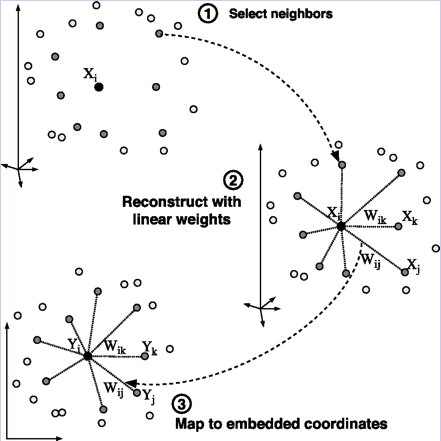

# LLE 局部线性嵌入
希望保持领域内样本点间的线性关系。一个流形在很小的局部邻域上可以近似看成欧式的即局部线性的。那么，在小的局部邻域上，一个点就可以用它周围的点在最小二乘意义下最优的线性表示。LLE把这个线性拟合的系数当成这个流形局部几何性质的刻画。那么一个好的低维表示，就应该也具有同样的局部几何，所以利用同样的线性表示的表达式，最终写成一个二次型的形式。  

即：在原高维空间中，有某点可由临近k点线性表示：
```mathjax
$$
x_1 = w_{12}x_2 + w_{13}x_3 +w_{14}x_4
$$
```
转化到低维空间中，权重（尽量）不变  
```mathjax
$$
x_1' \approx w_{12}x_2' + w_{13}x_3' +w_{14}x_4'
$$
```  
## 理论推导：
用均方差cost进行推导：
```mathjax
$$
\begin{align} J(W) & =  \sum\limits_{i=1}^{m}||x_i-\sum\limits_{j \in Q(i)}w_{ij}x_j||_2^2  \\& = \sum\limits_{i=1}^{m}||\sum\limits_{j \in Q(i)}w_{ij}x_i-\sum\limits_{j \in Q(i)}w_{ij}x_j||_2^2  \\& = \sum\limits_{i=1}^{m}||\sum\limits_{j \in Q(i)}w_{ij}(x_i-x_j)||_2^2  \\& =  \sum\limits_{i=1}^{m} W_i^T(x_i-x_j)(x_i-x_j)^TW_i \end{align}  
$$  
```
其中对于权重系数满足：
```mathjax
$$
\begin{align} \sum\limits_{j \in Q(i)}w_{ij} = 1\\
W_i =(w_{i1}, w_{i2},...w_{ik})^T    \end{align} 
$$
```  
我们令局部协方差矩阵Z~i~=(x~i~−x~j~)(x~i~−x~j~)^T^, j∈Q(i),则第(4)式进一步简化为:
```mathjax
$$
\begin{align} J(W) =  \sum\limits_{i=1}^{k} W_i^TZ_iW_i    \end{align}  
$$
```    
进一步简化第(2)式为（1~k~表示k*1的1向量）:
```mathjax
$$
\begin{align} \sum\limits_{j \in Q(i)}w_{ij} = W_i^T1_k = 1 \end{align}  
$$
```  
所以：  
```mathjax
$$
\begin{align} L(W) =  \sum\limits_{i=1}^{k} W_i^TZ_iW_i + \lambda(W_i^T1_k - 1) \end{align}  
$$
```  
要想求W求导即可：
```mathjax
$$
\begin{align} W_i = \frac{Z_i^{-1}1_k}{1_k^TZ_i^{-1}1_k} \end{align}  
$$
```  
现在我们把权重回带到低维空间，进行低维嵌入，得到新的损失函数：  
```mathjax
$$
\begin{align} J(y) = \sum\limits_{i=1}^{m}||y_i-\sum\limits_{j=1}^{m}w_{ij}y_j||_2^2 \end{align}  
$$
```    
加入约束条件  
```mathjax
$$
\begin{align} \sum\limits_{i=1}^{m}y_i =0;\;\; \frac{1}{m}\sum\limits_{i=1}^{m}y_iy_i^T = I \end{align}  
$$
```    
可得  
```mathjax
$$
\begin{align} J(Y) & =  \sum\limits_{i=1}^{m}||y_i-\sum\limits_{j=1}^{m}w_{ij}y_j||_2^2  \\& = \sum\limits_{i=1}^{m}||YI_i-YW_i||_2^2  \\& = tr(Y(I-W)(I-W)^TY^T) \end{align}
$$
```      
再令 M = (I - W)(I - W)^T^, 损失函数变为  
```mathjax
$$
J(Y) = tr(YMY^T) \\
s.t. YY^T=mI
$$
```  
一样的求导：
```mathjax
$$
L(Y) = tr(YMY^T+\lambda(YY^T-mI))\\
{\partial L \over \partial Y }= 2MY^T + 2\lambda Y^T =0\\
即：MY^T = \lambda Y^T
$$
```  
所以说取M矩阵的特征值即可啦  
## 算法流程：
1. for i =1 : m,  按欧式距离作为度量，计算和x~i~最近的的k个最近邻
2. for i =1 : m, 求出局部协方差矩阵Z~i~=(x~i~−x~j~)^T^(x~i~−x~j~),并由公式（10）求出对应的权重系数
3. 由权重系数向量W~i~组成权重系数矩阵W,计算矩阵M=(I−W)(I−W)^T^
4. 计算矩阵M的前d+1个最小特征值（需要舍弃掉特征值为0的解），并计算这d+1个特征值对应的特征向量{y~1~,y~2~,...y~d+1~}。
5. 由第二个特征向量到第d+1个特征向量所张成的矩阵即为输出低维样本集矩阵  
## 实现代码（MATLAB）：  
```matlab
% LLE ALGORITHM (using K nearest neighbors)
%
% [Y] = lle(X,K,dmax)
%
% X = data as D x N matrix (D = dimensionality, N = #points)
% K = number of neighbors
% dmax = max embedding dimensionality
% Y = embedding as dmax x N matrix

%%%%%%%%%%%%%%%%%%%%%%%%%%%%%%%%%%%%%%%%%%%%%%%%%%%%%%%%%%%%

function [Y] = lle(X,K,d)

[D,N] = size(X);
fprintf(1,'LLE running on %d points in %d dimensions\n',N,D);


% STEP1: COMPUTE PAIRWISE DISTANCES & FIND NEIGHBORS 
fprintf(1,'-->Finding %d nearest neighbours.\n',K);

X2 = sum(X.^2,1);
distance = repmat(X2,N,1)+repmat(X2',1,N)-2*X'*X;

[sorted,index] = sort(distance);
neighborhood = index(2:(1+K),:);


% STEP2: SOLVE FOR RECONSTRUCTION WEIGHTS
fprintf(1,'-->Solving for reconstruction weights.\n');

if(K>D) 
  fprintf(1,'   [note: K>D; regularization will be used]\n'); 
  tol=1e-3; % regularlizer in case constrained fits are ill conditioned
else
  tol=0;
end

W = zeros(K,N);
for ii=1:N
   z = X(:,neighborhood(:,ii))-repmat(X(:,ii),1,K); % shift ith pt to origin
   C = z'*z;                                        % local covariance
   C = C + eye(K,K)*tol*trace(C);                   % regularlization (K>D)
   W(:,ii) = C\ones(K,1);                           % solve Cw=1
   W(:,ii) = W(:,ii)/sum(W(:,ii));                  % enforce sum(w)=1
end;


% STEP 3: COMPUTE EMBEDDING FROM EIGENVECTS OF COST MATRIX M=(I-W)'(I-W)
fprintf(1,'-->Computing embedding.\n');

% M=eye(N,N); % use a sparse matrix with storage for 4KN nonzero elements
M = sparse(1:N,1:N,ones(1,N),N,N,4*K*N); 
for ii=1:N
   w = W(:,ii);
   jj = neighborhood(:,ii);
   M(ii,jj) = M(ii,jj) - w';
   M(jj,ii) = M(jj,ii) - w;
   M(jj,jj) = M(jj,jj) + w*w';
end;

% CALCULATION OF EMBEDDING
options.disp = 0; options.isreal = 1; options.issym = 1; 
[Y,eigenvals] = eigs(M,d+1,0,options);
Y = Y(:,2:d+1)'*sqrt(N); % bottom evect is [1,1,1,1...] with eval 0


fprintf(1,'Done.\n');

%%%%%%%%%%%%%%%%%%%%%%%%%%%%%%%%%%%%%%%%%%%%%%%%%%%%%%%%%%%%


% other possible regularizers for K>D
%   C = C + tol*diag(diag(C));                       % regularlization
%   C = C + eye(K,K)*tol*trace(C)*K;                 % regularlization

```