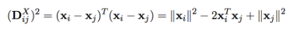
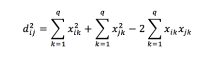
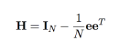
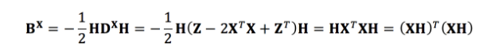
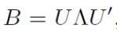
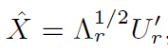

# MDS 多维标度法
用于已知距离的非线性降维    

  多维标度法解决的问题是：当n个对象（object）中各对对象之间的相似性（或距离）给定时，确定这些对象在低维空间中的表示，并使其尽可能与原先的相似性（或距离）“大体匹配”，使得由降维所引起的任何变形达到最小。多维空间中排列的每一个点代表一个对象，因此点间的距离与对象间的相似性高度相关。   
  
  简言之，在降维过程中，要求原始空间样本点间（欧式）距离得到保持。
## 算法步骤：    
证明过程详见西瓜书227，概括一下就是一个由距离矩阵求降维后内积矩阵(B=Z^T^Z)的过程
1. 计算距离矩阵 D^X^  
                      
即：  
                           
2. 得到内积矩阵：  
```mathjax
$$
b_{ij} =- \frac 1 2 (dist_{ij}^2-dist_{·j}^2-dist_{i·}^2+dist_{··}^2)
$$
```
由此关系式可求出B，于是定义一个中心矩阵centering matrix H：  
    
代码来说就是H = eye(10)-ones(10)/10;  

  
3. 对B进行正交分解求得特征向量即完成降维  
    
取前d个特征值和对应的特征向量，构成新的向量空间r
