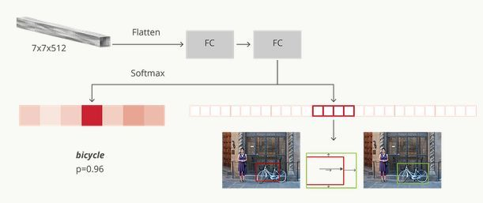
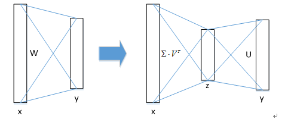

# Fast R-CNN
## R-CNN缺点
1. 训练过程是多级流水线；
2. 训练在时间和空间上是的开销很大；
3. 目标检测速度很慢。

&emsp;&emsp;R-CNN很慢在于它为每个目标候选框进行卷积神经网络正向传递，而不共享计算。而SPPnet通过共享计算加速R-CNN，计算整个输入图像的卷积特征图，然后使用从共享特征图提取的特征向量来对每个候选框进行分类，这样每张图像只做一次卷积特征提取操作。但SPP仍然为pipeline操作模式，也需要好几个步骤，磁盘存储等。  
&emsp;&emsp;提出Fast R_CNN具有以下优点：
        1. 比R-CNN和SPPnet具有更高的目标检测精度（mAP）。
        2. 训练是使用多任务损失的单阶段训练。
        3. 训练可以更新所有网络层参数。
        4. 不需要磁盘空间缓存特征。
## 提一嘴SPP
###  空间金字塔池化
主要解决的问题：CNN输入图像尺寸必须固定，需要提前裁剪。  
  
输入层：一张任意大小的图片,假设其大小为(w,h)。
输出层：21个神经元。

如图，把一张图进行三次分割并最大池化，分别分成4\*4\*256，2\*2\*256，1\*1\*256的子窗口，在每个子窗口中进行最大池化操作，最后展成一个21\*256维度的向量。（当然你可以设计其它维数的输出，增加金字塔的层数，或者改变划分网格的大小）。其中的每一种刻度即金字塔的某一层。具体操作即池化时手动输入stride为（w/n, h/n）。
### 用于目标检测
大体上与R-CNN相同，不同处在于特征提取阶段：
&emsp;&emsp;**把整张待检测的图片，输入CNN中，进行一次性特征提取，得到feature maps，然后在feature maps中找到各个候选框的区域，再对各个候选框采用金字塔空间池化，提取出固定长度的特征向量。**
## 架构与训练
Fast R-CNN网络将整个图像和一组候选框作为输入。网络首先使用几个卷积层和最大池化层来处理整个图像，以产生卷积特征图。然后，对于每个候选框，RoI池化层从特征图中提取固定长度的特征向量。每个特征向量被送入一系列全连接层中，其最终分支成两个同级输出层 ：一个输出K个类别加上1个背景类别的Softmax概率估计，另一个为K个类别的每一个类别输出四个实数值。每组4个值表示K个类别的一个类别的检测框位置的修正。
### RoI pooling
利用SPP Net的思想，使用最大池化将任何有效的RoI内的特征转换成具有H×W（例如，7×7）的固定空间范围的小特征图，其中H和W是层的超参数。本文中每个RoI由四元组(r,c,h,w)定义，其中前两个参数是左上角点的坐标。
&emsp;&emsp;RoI最大池化将原大小h\*w的feature map划分为H\*W个，尺寸为h/H\*h\*H的子窗口。在每个子窗口的每一个channel上做最大池化得到特征向量。
### 网络初始化
1. 经过卷积层，最后的一个池化层由上文提到的RoI层替代，输出特定尺寸feature vector；
2. 将最后一个全连接层和softmax（原来是用于ImageNet1000类的）替换为一个全连接层连一个K+1个类别的Softmax以及类别特定的检测框回归；

3. 网络被修改为采用两个数据输入：图像的列表和这些图像中的RoI的列表。
### 针对物体检测的微调
SPP的缺点在于其权重更新不能在金字塔池化层之前的卷积层进行。其根本原因是当每个训练样本（即RoI）来自不同的图像时，通过SPP层的反向传播是非常低效的，这正是训练R-CNN和SPPnet网络的方法。低效是因为每个RoI可能具有非常大的感受野，通常跨越整个输入图像。由于正向传播必须处理整个感受野，训练输入很大（通常是整个图像）。
#### 训练方法
利用训练期间的特征共享。在Fast RCNN网络训练中，随机梯度下降（SGD）的minibatch是被分层采样的，首先采样N个图像，然后从每个图像采样R/N个 RoI。关键的是，来自同一图像的RoI在向前和向后传播中共享计算和内存。减小N，就减少了小批量的计算。（本文中，一个典型的取值是N = 2，R = 128）（另外，虽然这样做，每次输入图像之间的相关性变高了，理论上说可能导致收敛变慢，但实验结果很好。What can you say ha?）
#### 多任务损失
如前文，Fast R-CNN有两路输出，一个是K+1个类别上的离散概率分布（由softmax算出）：
 ```mathjax
$$
p = (p_0,···,p_K)
$$
```
另一个是K+1个输出检测框回归偏移的回归器，对于第K个类别，有$t^k = (t^k_x, t^k_y, t^k_w, t^k_h)$参考R-CNN，t^k^表示的是第K个类别预测bounding box相对于其真实的尺度不变平移和对数空间高度/宽度缩放（scale-invariant translation and log-space height/width shift）。

每个训练中的RoI都有一个标记的类别真值u，和一个bounding box真值v。联合多任务损失：
 ```mathjax
$$
L(p,u,t^u,v) = L_{class}(p, u)+\lambda [u \ge 1]L_{location}(t^u, v)
$$
```
其中$[u \ge 1]$ 为一个指示函数，$u=\begin{cases}1, & u\ge1\\0,& \text{else}\end{cases}$
超参数$\lambda$控制两个任务损失之间的平衡，将回归目标真值$v_i$ 归一化为零均值和单位方差。这样，所有实验都使用$\lambda = 1$。
而对于背景，u = 0，也没有bounding box，因此忽略其$L_{location}$
类别损失$L_{class}$比较好定义，是类真值u的log损失： $L_{class}(p, u) = -logp_u$ 

而定位的回归损失$L_{location}$由类别u的检测框回归目标真值元组$v = (v_x, v_y, v_w, v_h)$和预测元组$t^u = (t^u_x, t^u_y, t^u_w, t^u_h)$共同使用鲁棒回归(robust regression)定义：
```mathjax
$$
L_{location}(t^u, v) = \sum_{i\in\{x,y,w,h\}} smooth_{L_1}(t_i^u-v_i)\\
其中smooth_{x}=\begin{cases}0.5x^2, & \text{if } |x|\lt 1\\
|x|-0.5,& \text{otherwise}\end{cases}
$$
```
单纯使用L2 loss则要求仔细调整学习速率，以防止爆炸梯度，使用鲁棒回归则不需要，并能减少outliers干扰。

实验发现，多任务损失比单纯选取进行分类，效果有一定的提升，mAP提高了0.8%~1.1%（多任务损失在测试时不采用Bounding-box regression）。 
#### 小批量采样
每个batch有128个RoI输入，来自于2张图片，其中25%来自正样本（和真实值交叉部分$IoU\ge 0.5$，也即$u\ge 1$），被标记为前景（foreground）。剩余75%为负样本（$IoU\in [0.1,0.5)$，也即$u = 0$），称为背景。其中下限0.1似乎用于充当难样本训练的启发式算法。在训练期间，图像以概率0.5水平翻转。不使用其他数据增强。
#### 通过RoI池化层的反向传播
[具体推导及图示见这篇博客](https://blog.csdn.net/WoPawn/article/details/52463853?locationNum=5)
y~ri~ 为第r个候选区域的第j个输出节点，一个输入节点可能和多个输出节点相关连，所以反向传播中损失函数L对输入层节点xi的梯度为损失函数L对各个有可能的候选区域r（x~i~被候选区域r的第j个输出节点选为最大值）输出y~ri~梯度的累加
```mathjax
$$
\frac{\partial L}{\partial x_i}=\sum_r\sum_j[i=i^*(r,j)]\frac{\partial L}{\partial y_{rj}}\\
[i=i^*(r,j)]=\begin{cases}
1,  & \text{$i=i^*(r,j)\ge1$ } \\
0, & \text{otherwise}
\end{cases}
$$
```
判决函数$[i=i^*(r,j)]$ 表示i节点是否被候选区域r的第j个输出节点选为最大值输出。
#### SGD超参数
1. 用于Softmax分类和检测框回归的全连接层的权重分别使用具有方差0.01和0.001的零均值高斯分布初始化。偏置初始化为0。
2. 所有层的权重为1倍的全局学习率，偏置为2倍的全局学习率，全局学习率为0.001。
3. 动量设置为0.9，权重衰减设置为0.0005。
### 尺度不变性
即：如何使24×24和1080×720的车辆同时在一个训练好的网络中都能正确识别。
用了两种实现尺度不变的方法： 
1. brute force （单一尺度single scale），直接将image设置为某种scale，直接输入网络训练，期望网络自己适应这个scale。 
2. image pyramids （多尺度multi scale），生成一个图像金字塔，在multi-scale训练时，对于要用的RoI，在金字塔上找到一个最接近227x227的尺寸，然后用这个尺寸训练网络。 
虽然看起来2比较好，但是非常耗时，而且性能提高也不多，大约只有%1，所以这篇论文在实现中还是用了方法1。
## Fast R-CNN detection
一旦Fast R-CNN网络被微调，检测相当于运行正向传播（假设对象建议框object proposal是预先计算的）网络将图像（或图像金字塔，编码为图像列表）和待给得分的 R 对象建议框（object proposal）列表作为输入。在测试阶段，R 大约为2K个，当使用图像金字塔的时候，每个RoI被指定尺度使得接近224*224。对于每个测试RoI r ，网络输出关于 r 的一个后验概率分布 p 和一系列预测bbox偏移（每个类 [共k个类] 获得自己的精确bbox预测）。然后使用估计概率给 r 赋予关于 k 个对象类的检测置信度。最后给每个类都实施一个非极大值抑制。
### 截断SVD Truncated SVD
在目标检测任务中，要处理的RoI数量比较多，几乎有一半的前向计算时间被用于全连接层：采用SVD分解加速全连接层计算！
1. 设全连接层权重为$W\in R^{u*v}$，对其进行奇异值分解并用前t个特征值近似代替：
```mathjax
$$
W \approx U \Sigma_t V^T
$$
```
截断SVD将参数量由原来的 u × v 减少到 t × (u + v)，当 t 远小于 min(u,v) 的时候降低了很大的计算量。

在实现时，相当于把一个全连接层拆分为两个全连接层，第一个全连接层使用权值矩阵（不含偏置），第二个全连接层使用矩阵U（含偏置）。
## 细节
### 候选区域越多越好吗？ 
随着候选区域个数的增加，mAP成先增加后缓慢下滑的趋势，这表明过多的候选区域会有损精度；
### 召回率（Average Recall）
即候选区域为真的窗口与Ground Truth的比值（IoU大于阈值即为真）。
然而在实验中发现，随着候选区域个数的增加，召回率并没有和mAP成很好的相关性，而是一直不断增加，也就是说更高的召回率并不意味着更高的mAP。
### 只做一次卷积如何映射到各个RoI？
对一个图像中提取的每个不同位置的RoI，只做了一次feature extraction（卷积），如何从卷积层最后的feature map中得到当前RoI的特征向量呢？我们知道在卷积特征提取过程中，不论是池化还是卷积造成的尺寸变化都是可以计算的。

卷积神经网络CNN中，某一层输出结果中一个元素所对应的输入层（这里的输入层可能隔开了好几层）的区域大小，被称作感受野receptive field。感受野的大小是由kernel size，stride，padding , outputsize 一起决定的。如下所示，是相邻两层间尺寸关系：
```mathjax
$$
output\_size = \frac {H-f+2*padding} {stride} +1\\
反推：input = (output\_size-1)*stride+f-2*padding\\
感受野r：r_i = (r_{i+1}-1)*stride_i + f_i 
$$
```
接下来是坐标映射：
```mathjax
$$
p_i = p_{i+1} * stride + \frac {f-1} {2} - padding
$$
```
式子中第一项表示第i层点坐标在i+1层上的坐标基数，第二项是移动到中心，第三项减去补零的偏移。