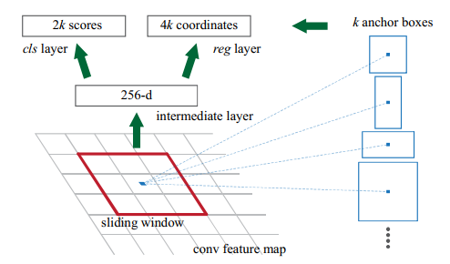
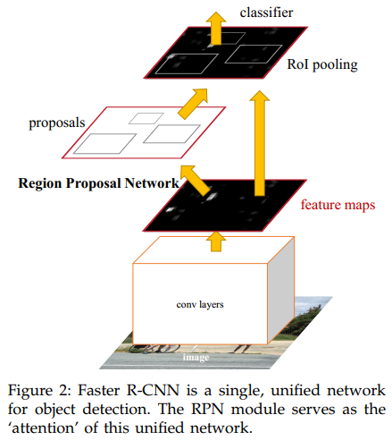

# 1. Faster R-CNN
Faster R-CNN由两部分组成，一个是提议区域的深度全卷积网络(RPN)，第二个模块是使用提议区域的Fast R-CNN检测器
## 1.1. Region Proposal Network(RPN)
用全卷积网络，以任意大小的图像作为输入，输出一组矩形的目标提议，每个提议都有一个目标得分。最终目标是与Fast R-CNN目标检测网络共享计算。

训练一个小网络，在最后一个共享卷积层的feature map上滑动选取n\*n(本文中选n=3)的feature窗口作为输入，每个窗口映射到一个低维特征（上图256维for ZFnet，512 for VGG)。然后输入到两个子全连接层，一个边界框回归层（reg）和一个边界框分类层（cls)。这种结构由一个n\*n卷积层，跟着两个sibling1\*1卷积层而实现。
### 1.1.1. Anchors
这里我的第一理解有错，正解参考[知乎上的这个答案](https://www.zhihu.com/question/42205480/answer/525212289)。

在每个滑动窗口位置，我们同时预测多个区域提议，其中每个位置可能提议的区域的最大数目表示为k。因此，reg层具有4k个输出，cls层输出2k个分数，估计每个提议是目标或不是目标的概率。
&emsp;&emsp;所谓k个anchor指的就是这k个proposal。k的数量与尺度、长宽比有关。选取3个尺度（大中小)，3个长宽比（1:2、2:1、1:1)。这样在每个滑动位置产生k=9个anchor。对于大小为W×H的卷积特征映射，总共有W\*H\*k个锚点。
&emsp;&emsp;这种方法的anchor具有平移不变(Translation-Invariant)性，因而减少了参数数量，在小数据集上更不易过拟合。(VGG每个窗口数据量为512×(4+2)×9)
### 1.1.2. Loss function
在所有anchor中，只有满足以下两种情况之一才会被分配给正标签：
1. 具有与实际边界框的重叠最高的IoU
2. 具有与实际边界框的重叠超过0.7的IoU 
负标签为IOU小于0.3
其他anchor对loss function的训练无作用

损失函数定义为：
```mathjax
$$
L(\lbrace p_i \rbrace, \lbrace t_i \rbrace) = \frac{1}{N_{cls}}\sum_i L_{cls}(p_i, p^{*}_i) \\\\ + \lambda\frac{1}{N_{reg}}\sum_i p^{*}_i L_{reg}(t_i, t^{*}_i).
$$
```
1. i是一个小批量数据中anchor的索引；
2. p~i~是该anchor是物体的预测概率；
3. p~i~^\*^为真实标签。如果锚点为正，值为1，如果锚点为负，则为0；
4. t~i~是表示预测边界框4个参数化坐标的向量；
5. t~i~^\*^是正anchor相关的真实边界框向量；
6. L~cls~分类损失是两个类别上（目标或不是目标）的对数损失；
7. L~reg~回归损失中，使用R鲁棒损失函数（平滑L1）$L_{reg}(t_i, t^{*}_i)=R(t_i - t^{*}_i)$
8. N~cls~ 和N~reg~是标准化项，前者等于batch size，后者等于anchor位置的数量（40*60feature map大小)；
9. λ是加权平衡参数，默认取10，使得cls和reg项权重大致相等
10. 而实验结果表明，在较大范围内对λ值不敏感，归一化也不是必需的，可以简化。

边界框回归对应的变化t：
```mathjax
$$
t_{\textrm{x}} =  (x - x_{\textrm{a}})/w_{\textrm{a}},\quad
t_{\textrm{y}} = (y - y_{\textrm{a}})/h_{\textrm{a}},\\\\
t_{\textrm{w}} = \log(w / w_{\textrm{a}}), \quad
t_{\textrm{h}} = \log(h / h_{\textrm{a}}),\\\\
t^{*}_{\textrm{x}} =  (x^{*} - x_{\textrm{a}})/w_{\textrm{a}},\quad
t^{*}_{\textrm{y}} = (y^{*} - y_{\textrm{a}})/h_{\textrm{a}},\\\\
t^{*}_{\textrm{w}} = \log(w^{*} / w_{\textrm{a}}),\quad
t^{*}_{\textrm{h}} = \log(h^{*} / h_{\textrm{a}}),
$$
```
其中变量x，x~a~和x^*^分别表示预测边界框，anchor box和实际边界框。
&emsp;&emsp;与前面的回归不同的是，本公式中用于回归的特征都是同样的大小(3\*3)。(之前R-CNN等都是对不同尺寸的RoI进行回归)。所以本应用中训练了k个这样的回归器，对应于k个不同的尺度和长宽比。k个回归器间不共享权重。这样就可以在每个anchor处预测出不同尺寸的边界框。

&emsp;&emsp;这堆公式个人理解使用方法是在训练时，计算真实转换函数t^*^和预测转换函数t之间的loss，在测试时，只用到前两排由anchor box计算预测bounding box。
### 1.1.3. 训练RPN
使用SGD训练，每个mini-batch来自于一张图像的多个正负样本anchor。但由于正负样本skew，所以这里的batch实质上是以接近1：1的比率从所有anchor中随机采样的256个。但当正样本不足128个时，我们也只能用负样本填充batch了。
### 1.1.4. RPN和Fast R-CNN共享特征
上一个模块介绍的是单独训练RPN的过程，而基于区域的目标检测网络在训练时需要用到RPN的提议区域，两个网络都需要共享基本的卷积层。分别训练的时候都会对底层卷积层做出修改，因此需要允许在两个网络之间共享卷积层，而不是学习两个独立的网络。有以下三种方法：

1. 交替训练。首先训练RPN，并使用这些提议来训练Fast R-CNN。由Fast R-CNN微调的网络然后被用于初始化RPN，并且重复这个过程。本文实验用本方案。

2. 近似联合训练。RPN和Fast R-CNN网络在训练期间合并成一个网络。在每次SGD迭代中，前向传递生成区域提议，这些提议被Fast R-CNN检测器看作是固定的、预计算的。反向传播中，对于共享层，组合来自RPN损失和Fast R-CNN损失的反向传播信号。但是这个解决方案忽略了关于提议边界框的坐标（个人理解就是RPN网络）的导数，因此是近似的。在实验中发现这个求解器产生了相近的结果，但与交替训练相比，训练时间减少了大约25−50%。

3. 非近似的联合训练。与2不同，我们知道RPN预测的边界框也是输入的函数。该方案中，需要一个关于边界框坐标可微分的RoI池化层。本文不讨论。
#### 1.1.4.1. 四步交替训练
1. 使用ImageNet的预训练模型进行初始化，并针对区域提议任务进行了端到端的微调。
2. 使用由第一步RPN生成的提议单独训练Fast R-CNN检测网络。该检测网络也由ImageNet的预训练模型进行初始化。此时两个网络不共享卷积层。
3. 使用检测器网络来初始化RPN训练，但是我们固定共享的卷积层，只对RPN特有的层进行微调。现在这两个网络共享卷积层。
4. 保持共享卷积层的固定不变，我们对Fast R-CNN的独有层进行微调。因此，两个网络共享相同的卷积层并形成统一的网络。
### 1.1.5. 实现细节
对于anchor，使用了3个尺度，边界框面积分别为128^2^，256^2^和512^2^个像素，以及1:1，1:2和2:1的长宽比。

&emsp;&emsp;如上图显示了使用ZF网络的每个anchor学习到的平均提议大小。注意到，本算法允许预测box比基础感受野更大。这样的预测不是不可能的——如果只有目标的中间部分是可见的，那么仍然可以粗略地推断出目标的范围。
&emsp;&emsp;在训练过程中，我们忽略了所有的跨界anchor，所以不会造成损失。对于一个典型的1000×600的图片，总共将会有大约20000（≈60×40×9）个锚点。跨界锚点被忽略后，每张图像约有6000个锚点用于训练。如果跨界异常值在训练中不被忽略，则会在目标函数中引入大的，难以纠正的误差项，且训练不会收敛。但在测试过程中，我们仍然将全卷积RPN应用于整张图像。如果产生跨边界的提议边界框会被剪切到图像边界。
&emsp;&emsp;一些RPN提议互相之间高度重叠。为了减少冗余，我们在提议区域根据他们的cls分数采取非极大值抑制。将NMS的IoU阈值固定为0.7，这就给每张图像留下了大约2000个提议区域。在NMS之后，我们使用前N个提议区域来进行检测。接下来，我们使用2000个RPN提议对Fast R-CNN进行训练，但在测试时评估不同数量的提议。
## 1.2. 实验
与传统Selective search等区域提议方法相对比。（多个数据集上）
消融实验：
1. **共享权重效果**。RPN+Fast R-CNN共享与不共享权重对比（四步训练过程的第二步之后停止训练，生成两个不共享权重的网络)；
2. **RPN提议效果**。用SS提议训练Fast R-CNN，并固定网络，只改变提议区域。此时RPN不共享特征。
3. **NMS不会损害检测mAP**。RPN在测试时使用排名最高的100个提议仍然会导致有竞争力的结果（55.1%）使用排名靠前的6000个RPN提议（无NMS）具有相当的mAP（55.2%），这表明排名靠前的RPN提议是准确的。
4. **移除cls**。因此不使用NMS排名，从未得分的区域中随机采样N个提议。当N=1000(55.8%)时，mAP几乎没有变化，但是当N=100时，会大大降低到44.6%。这表明cls分数考虑了排名最高的提议的准确性。
5. **移除reg**。提议直接变成anchor，mAP将下降到52.1%。表明高质量的提议主要是由于回归的边界框。anchor虽然具有多个尺度和长宽比，但不足以进行准确的检测。
6. 比较不同网络上的效果。VGG和ZF Net
7. **对超参数的敏感度**。每个位置只使用一个anchorVS多尺度anchor（scale/aspect)。仅使用具有1个长宽比（69.8%）的3个尺度与使用具有3个长宽比的3个尺度一样好，这表明尺度和长宽比不是检测准确度的解决维度。