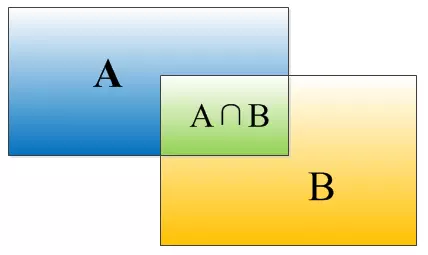
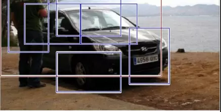
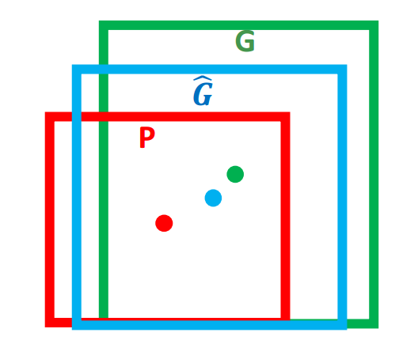

# R-CNN
（Selective Search + CNN + SVM）  
  
## Region Proposal：选择性搜索
以图的最小生成树方法，先计算相邻像素点间的相似度，排序后以最小生成树方法连接像素点。其中相似度的度量可以改变，如色差，纹理（梯度）等。
## Feature Extraction：AlexNet
将region proposal的区域进行缩放（AlexNet输入只能是227*227），送入CNN。
## 训练
1. **有监督预训练**，达到AlexNet水平；
2. **特定领域的参数调优。** 第一步中的CNN替掉了ImageNet专用的1000路分类层，换成了一个随机初始化的(N+1)路分类层，其中N是类别数，1代表背景，而卷积部分都没有改变。对于所有的推荐区域，如果其和真实标注的框的IoU重叠>= 0.5就认为是正例，否则就是负例；
3. **目标种类分类器。**  对每个种类，使用一个SVM分类器进行打分，而不是使用softmax。正样本的选定通过计算其与真值的IOU，当IOU大于0.3时为正例。
## 补充解释
### IOU
IOU = (A∩B)/(A∪B)

### 非极大值抑制
对于RCNN来说，会从图中找出多个可能是物体的矩形框，然后为这些矩形框做类别分类概率，如下图，定位一个车辆，检测出多个可能是车辆的矩形框，我们此时需要判断哪些框有用哪些无用。

假设检测出6个框，根据分类器的分类概率进行排序，假设从大到小的概率为ABCDEF
1. 将概率最大的框A，分别与BCDEF框计算出IOU是否大于某个设定的阈值
2. 假设BC与A的IOU大于阈值，则丢去BC，然后标记A是我们保留的  
3. 此时剩下DEF，从DEF中选择概率最大的D，让EF分别与D计算IOU值，如果大于阈值则丢去，标记D为我们保留的  
4. 不断重复，找到所有被保留下来的矩形框
### 两个IOU？
为什么训练CNN和训练SVM时候，使用了不同的标准来定义正负样本呢？调参结果显示如此，推测是为了增加样本数量，避免过拟合。CNN的softmax改为SVM也是类似的原因，作者认为原因在于softmax中的背景样本是共享的，而SVM的背景样本是独立的，更加hard，所以能够带来更好的分类效果。  

cnn在训练的时候，对训练数据做了比较宽松的标注，比如一个bounding box可能只包含物体的一部分，那么我也把它标注为正样本，用于训练cnn；  
采用这个方法的主要原因在于因为CNN容易过拟合，所以需要大量的训练数据，所以在CNN训练阶段我们是对Bounding box的位置限制条件限制的比较松(IOU只要大于0.5都被标注为正样本了)；  
然而svm训练的时候，因为svm适用于少样本训练，所以对于训练样本数据的IOU要求比较严格，我们只有当bounding box把整个物体都包含进去了，我们才把它标注为物体类别，然后训练svm，此时IOU阈值选取的就是小于0.3为负样本。
### Hard Negative mining method
由于正负样本数量不均衡，反例分散且代表性不够，把每次顽固的错误不停送回分类器进行训练，直到成绩不再上升。（该过程收敛很快，基本一轮收敛）
### Bounding Box Regression
又多加了一个Bounding Box Regression来提升定位准确性。在对region proposal用SVM打分后，使用一个特定类的边界框回归器来预测新的边界框。
&emsp;&emsp;**输入**：N个训练对 $(P^i, G^i)_{i=1,……,N}${( 其中$P^i=(P^i_x, P^i_y, P^i_w, P^i_h)$表示了推荐区域正中间坐标和区域宽高。G表示ground-truth的四个坐标值。
但是直觉上说，你想通过四个数字就能变到另四个数字的变化组合，而且能泛化到整个模型上，听起来就不科学，怎么也要用到CNN提取的特征吧，**其实真正的输入是这个窗口对应的 CNN 特征，也就是 R-CNN 中的 Pool5 feature**（特征向量）。这样，才不是“硬”拟合，如果只是输入P代表的四个数的话，那就是一个CNN外部的统计问题了，CNN在这个回归器里一点作用也没起到，但是仔细想的话，bounding box的位置确实应该由CNN计算得到的features来fine-tune。
&emsp;&emsp;**目标**：学习由proposal映射到ground-truth的变换，得到$\hat G$

&emsp;&emsp; 如何由P变为 $\hat G$ ？比较简单的思路就是: **平移+尺度放缩**
1. 先做平移 $(x, y)+(\Delta x, \Delta y)$, 我们令 $\Delta x = P_wd_x(P), \,\, \Delta y = P_hd_y(P)$ 即R-CNN论文中的：
 ```mathjax
$$
\hat G_x = P_w d_x(P) + P_x \\
\hat G_y = P_h d_y(P) + P_y
$$
```
2. 再做尺度缩放 $(P_w, P_h).*(S_w, S_h)$, 同样令$S_w =exp(d_w(P)), S_h =exp(d_h(P))$ 即论文中的（S表示scale）：
```mathjax
$$
\hat G_w = P_wexp(d_w(P)) \\
\hat G_h = P_hexp(d_h(P))
$$
```
理论上，每一张图片（真实值）都有一个最优的变换：
```mathjax
$$
G_x = P_w t_x(P) + P_x \\
G_y = P_h t_y(P) + P_y \\
G_w = P_w exp(t_w(P)) \\
G_h = P_h exp(t_h(P))
$$
```
也就是说，一个d对应着一个t，用i表示一张图片的序号，我们的想法是让 $d_i \rightarrow t_i$
将CNN pool5层的features记为$\Phi_{5i}$，我们定义一个权重矩阵 $w_i$ 来表示这个关系（这里进一步说明了前面黑体字部分，其实真正回归器的输入应该是feature，根据它来回归求相应的位置关系）:
```mathjax
$$
d_i = w_i^T \Phi_{5i}
$$
```
这样loss就出来了：
```mathjax
$$
loss = \sum_i^N (t_i - w_i^T\Phi_{5i})^2 + \lambda||w_i||^2 \\
W^* = argmin_w (loss)
$$
```
其中多加了个正则化项，用最小二乘法或梯度下降可解。（t用G和P的式子代）
这样的话，如果在测试模型的时候，经过一堆CNN和其他的计算，我们得到了一个“暂时最优”的bounding box。经过我们在训练时回归器得到的那个变换$w^∗$，对pool5得到的feature操作一下，就得到了一个变换d，再用这个d对我们测试用图propose出来的那个bounding box操作一下，就将其“优化”了。而论文中的数据显示，bounding box regression确实是有用的。