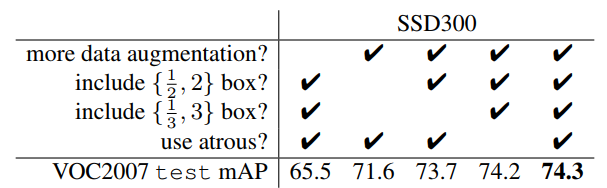

# SSD
SSD的核心是预测固定的一系列默认边界框的类别分数和边界框偏移，使用更小的卷积滤波器应用到特征映射上。
## Model
SSD产生固定大小的边界框集合，并对这些边界框中存在的目标类别实例进行评分，然后进行非极大值抑制步骤来产生最终的检测结果。
### Multi-scale feature maps for detection
在分类网络为基础的预训练网络最后将用于分类的层去掉，称为base network。在其后添加卷积层逐渐减小feature map尺寸，并使得检测在多尺度上运行。
### Convolutional predictors for detection  
每个添加的feature map可以使用一组卷积滤波器产生固定的检测预测集合。对于具有$p$通道的大小为$m \times n$的特征层，使用$3 \times 3 \times p$的卷积核得到某个类别的分数或相对于默认box坐标的形状偏移(offset)。

bounding box offset值是相对于默认box在每个feature map中的相对位置测量的。
### Default boxes and aspect ratios
对于网络顶部的多个feature map，我们将一组默认边界框与每个feature map cell相关联。这里的default box和anchor很类似。在每个feature map cell中，每个疑似物体位置预测k个box，每个box预测4个相对于默认边框的坐标offset和c个类别。这样前面说的添加的滤波器的深度就知道了，是$(c+4)k$个，输出是$m\times n\times (c+4)k$维度。

## Training
SSD的训练与R-CNN等区域提议网络在训练中的区别在于真值信息需要分配给检测器的一系列固定输出中的某一确定的输出。这将是本节重点，除此之外，训练中也设计了数据增广和hard negative mining(错的反例不断重新训练)。
### Matching strategy
确定哪些哪些默认边界框对应真实边界框的策略：
&emsp;&emsp;先将GT匹配给最高jaccard overlap(即IOU)。
&emsp;&emsp;另外，与GT重叠大于某一阈值(0.5)的default box也会匹配上来。(MultiBox方法中是只匹配最高)
### Training objective训练目标函数
设$x_{ij}^p = \lbrace 1,0 \rbrace$是第$i$个默认边界框匹配到类别为$p$的第$j$个实际边界框的指示器。所以有：$\sum_i x_{ij}^p \geq 1$(至少有一个目标)。
总体objective loss function是定位(loc)和置信度(conf)损失的加权和：
```mathjax
$$
L(x, c, l, g) = \frac{1}{N}(L_{conf}(x, c) + \alpha L_{loc}(x, l, g))\\
$$
```
1. 其中N是匹配的默认边界框的数量。如果$N=0$，则将损失设为0。其中$\alpha$经交叉验证设为1。
2. 定位误差是预测box（$l$）与真值（$g$）参数之间的Smooth L1 loss。但与Faster R-CNN类似，我们对默认边界框($d$)的中心偏移量($cx, cy$)和其宽度($w$)、高度($h$)进行回归。
```mathjax
$$
L_{loc}(x,l,g) = \sum_{i \in Pos}^N \sum_{m \in \lbrace cx, cy, w, h \rbrace} x_{ij}^k \mathtt{smooth}_{L1}(l_{i}^m - \hat{g}_j^m) \\
\hat{g}_j^{cx} = (g_j^{cx} - d_i^{cx}) / d_i^w \quad \quad
\hat{g}_j^{cy} = (g_j^{cy} - d_i^{cy}) / d_i^h \\
\hat{g}_j^{w} = \log\Big(\frac{g_j{w}}{d_iw}\Big) \quad \quad
\hat{g}_j^{h} = \log\Big(\frac{g_j{h}}{d_ih}\Big)
$$
```
3. 置信度loss是多种类置信度（c）的softmax loss。
```mathjax
$$
L_{conf}(x, c) = - \sum_{i\in Pos}^N x_{ij}^p log(\hat{c}_i^p) - \sum_{i\in Neg} log(\hat{c}_i^0)\quad \mathtt{where}\quad\hat{c}_i^p = \frac{\exp(c_i^p)}{\sum_p \exp(c_i^p)}
$$
```
### Choosing scales and aspect ratios for default boxes
多尺寸借助于不同层的feature map实现。(主要是因为不同层具有不同的感受野大小)

不同层的feature map训练来预测不同的尺寸。假设我们要使用$m$个特征映射进行预测。m个特征映射默认边界框的尺度计算如下：
```mathjax
$$
s_k = s_\text{min} + \frac{s_\text{max} - s_\text{min}}{m - 1} (k - 1),\quad k\in [1, m]
$$
```
其中$s_\text{min}$为0.2，$s_\text{max}$为0.9，意味着最低层具有0.2的尺度，最高层具有0.9的尺度，而在它们之间层的尺度是等距分布的。

我们为默认边界框添加不同的长宽比，并将它们表示为$a_r \in {1, 2, 3, \frac{1}{2}, \frac{1}{3}}$。由此可计算每个边界框的宽度($w_k^a = s_k\sqrt{a_r}$)和高度($h_k^a = s_k / \sqrt{a_r}$)。（个人理解根号来源于想让$w/h=a，w\times h=s$的同时，让a在两个参数里都有影响，就一人分了一个根号a）。若长宽比为1，我们还添加了一个默认边界框，其尺度为$s'_k = \sqrt{s_k s_{k+1}}$，这样在每个feature map位置得到6个默认边界框。

我们将每个默认边界框的中心设置为$(\frac{i+0.5}{|f_k|}, \frac{j+0.5}{|f_k|})$，其中$|f_k|$是第$k$个特征映射的大小，$i, j\in [0, |f_k|)$。（这里|f~k~|暂时没懂）

这里可以看出其坐标是0，1之间的，都是相对坐标。在实践中，也可以设计默认边界框的分布以最适合特定的数据集。

这样将不同层(scale)，不同aspect ratio的默认边框预测结合起来，便可以得到覆盖各种形状大小的预测。比如说：在第二张图中，狗的边界框（红色）只和4\*4的feature map中的一个默认边界框匹配，没和8\*8的匹配。
### Hard negative mining
在匹配步骤之后，大多数默认边界框为负例，这在正、反样本间引入了显著的不平衡。本文的解决方法是不使用所有的反例，而是对其置信度进行排序选最高，使得正负样本间比例为1：3。这样会导致更快的优化和更稳定的训练。
### Data augmentation 
每张训练图像都是通过以下选项之一进行随机采样的：
* 使用整个原始输入图像
* 采样一个图像块，使得与目标之间的最小IOU为0.1，0.3，0.5，0.7或0.9。
* 随机采样一个图像块。

每个采样图像块的大小是原始图像大小的[0.1，1]，长宽比在0.5和2之间。如果实际边界框的中心在采样的图像块中，我们保留实际边界框与采样图像块的重叠部分。在上述采样步骤之后，除了应用一些光度变形之外，将每个采样图像块调整到固定尺寸并以0.5的概率进行水平翻转。
## 实验
骨架使用VGG，将最后两层全连接网络（fc6,fc7）换成卷积网络，参数从全连层采样得到。将pool5从$2\times 2-s2$更改为$3\times 3-s1$，并使用多孔算法（a trous algorithm）来填补“小洞”。删除所有的丢弃层和fc8层。用SGD，初始学习率为$10^{-3}$，动量0.9，权重衰减0.0005，batchsize 32来微调模型。

实验结果表明，相较于Faster R-CNN，SSD的定位误差较小，但对于相近的种类检测容易出错。并且对bbox的尺寸很敏感，小尺寸的物体检测率很低
## 模型分析
对模型进行了控制实验以检查每个组件对总体性能的影响：

### 数据增广很重要
Fast和Faster R-CNN只使用了原始图像及其水平翻转来训练。我们使用了更广泛的抽样策略。
### 更多的默认边界框形状会更好
### Atrous多孔算法帮助提高检测速度
如果使用完整的VGG16，保持pool5为2×2-s2，并且不从fc6和fc7中子采样参数，并添加conv5_3进行预测，结果大致相同，而速度慢了大约20%。
### 多个不同分辨率尺度的输出层更好
在本节中，为了验证不同层对结果的影响，不断删除了一些层得到了结果：

解释一下上表中有关Box数量的问题。文中为了尽量避免Box数量影响，每删除一层就会重新调整默认边界框，使其总数在原来的总数8732左右。这是通过在剩余层上堆叠更多尺度的边界框并根据需要调整边界框的尺度来完成的。在增加其他尺度边界框的过程中采用了Faster R-CNN中的策略，对于超出边界的边界框，直接删除。这样的处理使比较粗糙的feature map，如conv11_2（1×1）或conv10_2（3×3）会大大伤害性能，因为处理后没有足够大的边界框来覆盖大的目标。当我们主要使用更高分辨率的特征映射时，性能开始再次上升，因为在修剪之后仍然有足够数量的大边界框。
表中use boundary boxes指是否使用边缘超出feature map的box
### Note：
COCO中的对象更小，所以在检测的时候，对尺度进行了调整，使用更小的尺度，S~min~=0.15
### 为小尺寸目标所做的数据增强
前面提到的数据增广在整张图片上取小patch，相当于将图片放大。为了创造缩小的数据集以提高小物体识别率，对数据进行缩小：首先将图像随机放置在填充了平均值的原始图像大小为16x的画布上，然后再进行任意的随机裁剪操作。
因此训练图像变多了，需要迭代更多次，但能有2%-3%的mAP增长。
当然改进方法还有重新设计scale的平铺方式，使其位置和尺度与特征映射上每个位置的感受野更好地对齐。（To be done）
### Inference Time
在网络最后还要有NMS的过程，在0.01置信度下，设置IOU阈值为0.45，并每张图片保留前200个检测。这一步会花费约1.7毫秒/图，接近在所有新增层上花费的总时间(2.4毫秒)。

SSD在速度还可以通过对base network(VGG)的改进而进一步加快。
## 总结
要注意到SSD与YOLO，Faster R-CNN的相类似之处。SSD使用了Faster R-CNN的anchor概念，并在YOLO的概念下，在每个cell都使用不同aspect ratio的default box。另外还扩展到了不同卷积层上。